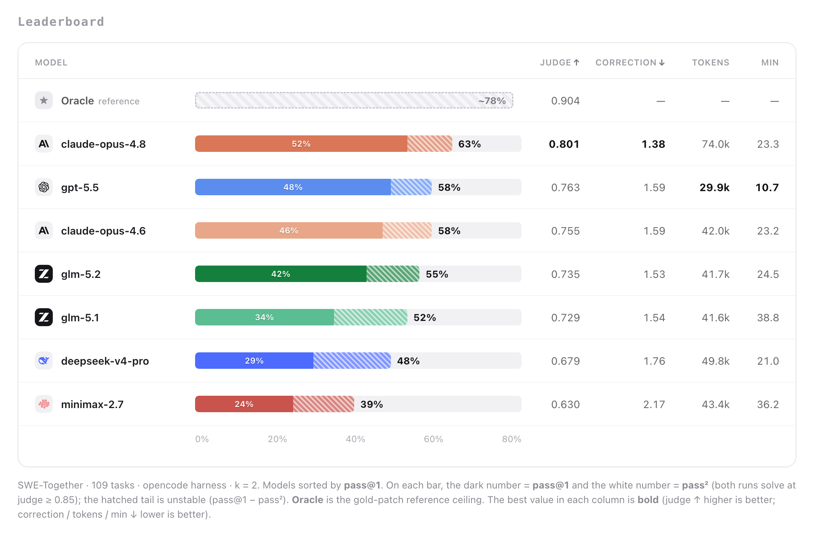

<h1 align="center">SWE-Together: Evaluating Coding Agents in Interactive User Sessions</h1>

<p align="center">
  <a href="https://arxiv.org/pdf/2606.29957"></a>
  <a href="https://togetherbench.com"></a>
  <a href="LICENSE"></a>
</p>

---

**SWE-Together** reconstructs the multi-turn loop from real user–agent sessions, replaying each with a reactive **user simulator** that ask questions, new requirements etc and preserves the original users' intents. 

- **109 tasks**, each a first user message + a replayable interaction, run in a sandbox.
- Pluggable coding agents: **opencode, claude-code, codex, mini-swe-agent**.
- Reported axes: **correctness** (agentic judge), **User Correction** (how much the user had to push back the agent).


<p align="center">
  
</p>


---

## Quickstart

### 1. Install

```bash
uv sync                  # creates .venv with harbor (editable) + deps
cp .env.example .env     # then fill in the keys you need (table below)
```

Run everything below with the project venv (`.venv/bin/python`) so harbor is importable.

You also need either an **E2B** account (cloud sandboxes, scales to 100+ concurrent) or local **Docker** (`--env-type docker`). Task images are pulled from `ghcr.io/togetherbench/*`.

### 2. Launch run

The launcher reads a plan and drives both stages. It is **dry-run by default** — it prints the commands; add `--execute` to actually run.

```bash
# Preview the full canonical run
.venv/bin/python launch.py canonical_full109.json

# Produce trials for one cohort, then score it
.venv/bin/python launch.py canonical_full109.json --stage run   --models opencode_opus48 --execute
.venv/bin/python launch.py canonical_full109.json --stage judge --models opencode_opus48 --execute
```

Trials land in `trials/canonical_full109/<tag>_r<k>/`; judge aggregates in `results/<tag>/`.

### 3. Optionally, run the two stages separately

```bash
# Stage 1 — agent solves the tasks (one cohort)
.venv/bin/python src/run_eval.py \
  --model openrouter/anthropic/claude-opus-4-8 \
  --tag opus48 --agent-type opencode --env-type e2b \
  --workers 25 --agent-timeout 4800 \
  --trials-dir trials/opus48_r1
# (--dry-run to preview, --tasks a,b for a subset, --skip-existing to resume,
#  rerun with --trials-dir trials/opus48_r2 for a replicate)

# Stage 2 — judge & score (repeat --trials-root per replicate)
.venv/bin/python -m eval.run_eval \
  --trials-root trials/opus48_r1 --trials-root trials/opus48_r2 \
  --tasks-root tasks --output-dir results/opus48 --model-tag opus48
```

---

## Environment keys

Most runs need only a subset; `.env.example` documents them all. Minimum for an opencode + Opus run on E2B:

| key | used for |
|---|---|
| `E2B_API_KEY` | the sandbox (run **and** judge) |
| `GEMINI_API_KEY` | user simulator + message tagging (**every** run) |
| `OPENROUTER_API_KEY` | the agent model (or the provider key matching your model) |
| `ANTHROPIC_API_KEY` | the Step-1 agentic judge |
| `GHCR_USER` / `GHCR_TOKEN` | pull task images from `ghcr.io/togetherbench/*` |


---

## How it works

Tasks are **progressively revealed**, not one-shot. The agent gets `instruction.md` as turn 0; a **user simulator** then watches it and replays the original session's follow-ups — clarifications, course-corrections, reviews — so a score reflects the whole interaction. Each cohort runs for multiple replicates.

Scoring centers on two axes:

- **Correctness** — an agentic judge decomposes each task into *weighted completeness goals* (frozen per task, so scores are comparable across cohorts) and marks the agent's patch against them, crediting near-misses fairly. Rolled up as `pass@1`, `stable_pass_rate`, and `pass²` at a `judge_score ≥ 0.85` bar.
- **User Correction** — `#correction + 0.2·nudge`, from per-message tags: how much the user had to push the agent back on track. 

---

## Tasks

Each task under `tasks/<name>/` carries its instruction, the user-simulation prompt, a Dockerized environment pinned to a base commit, a `tests/` gate suite, and a reference patch + frozen judge rubric. The launcher's plan (`canonical_full109.json`) lists the canonical 109; edit `models` / `replicates` / `tasks` there to define your own run.

---

## Citation

If you use SWE-Together, please cite our [paper](https://arxiv.org/pdf/2606.29957):

```bibtex
@article{wu2026swetogether,
  title   = {SWE-Together: Evaluating Coding Agents in Interactive User Sessions},
  author  = {Wu, Yifan and Zhao, Zhuokai and Li, Songlin and Lee, Ho Hin and Zhu, Jiacheng and Wu, Shirley and Yu, Tianhe and Li, Serena and Zhang, Lizhu and Fan, Xiangjun and Li, Shengzhi},
  year    = {2026},
  journal = {arXiv preprint arXiv:2606.29957},
  url     = {https://arxiv.org/pdf/2606.29957}
}
```
