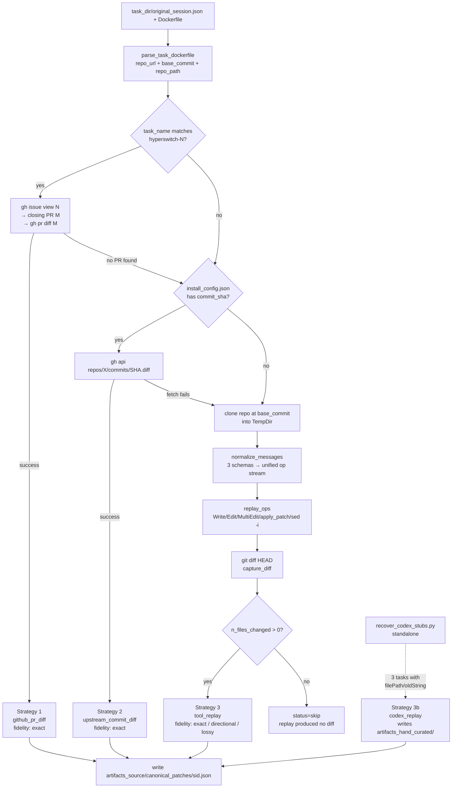

# Canonical-Patch Extraction Pipeline

This is the definitive description of how a raw multi-turn session JSON becomes
a verified, schema-conforming canonical patch that downstream consumers
(verifier scoring, SWE-rebench config builders, leaderboard replays, the patches
visualization) can trust.

If you are new to the project, read this end-to-end before you touch any file
under `data-pipeline/artifacts_*/canonical_patches/` or
`harbor_tasks/*/reference_patch.json`. The pipeline has a lot of mechanical
detail, but it also has a lot of *non-obvious* fixed points (the two-layer
storage model, the sync invariant, the dispatch-by-content rule) that are easy
to break.

Snapshot: this document describes the corpus as of **2026-05-16** — 147 source
JSONs, 166 reference JSONs (144 real + 22 stubs), 0 smell-test failures, 0
unresolved round-2 FLAGs.

---

## 1. The two-layer storage model

A canonical patch lives in **two** places on disk. Both layers carry the same
core fields (`patch`, `files_changed`, `numstat`, ...). The split is
deliberate.

### 1a. Source layer — `data-pipeline/artifacts_<source>/canonical_patches/<session_id>.json`

* One file per **session** (not per task; in principle multiple tasks could
  share a session, though we don't currently do that).
* Filename is the session's UUID (Anthropic CC, pi-share, dataclaw) or its
  upstream-PR-derived placeholder (hyperswitch — see §2.1).
* Written by the extractor (`data-pipeline/scripts/step4_extract_canonical_patches.py`)
  and the hand-curate workflow (`artifacts_hand_curated/...`).
* This is the **authoritative copy.** Edit here, then sync down.

The directory structure routes by **source corpus** (the upstream session
provider), not by task or by extraction strategy:

```
data-pipeline/
  artifacts_agent-swarm/canonical_patches/   #   3 patches
  artifacts_amytis/canonical_patches/        #   3
  artifacts_cc-backend/canonical_patches/    #   2
  artifacts_cli/canonical_patches/           #  44   (entireio/cli — biggest single corpus)
  artifacts_comfyui/canonical_patches/       #   5
  artifacts_dataclaw/canonical_patches/      #   2
  artifacts_hand_curated/canonical_patches/  #  11   (manual rescues; not auto-extractable)
  artifacts_hyperswitch/canonical_patches/   #  17   (juspay/hyperswitch — gh-pr-diff path)
  artifacts_pi-mono/canonical_patches/       #  23
  artifacts_sd-scripts/canonical_patches/    #   3
  artifacts_unknown/canonical_patches/       #  34   (heterogeneous repos, no cluster)
```

Total: **147** source-layer JSONs.

Why split by source? Two reasons. (a) Each source has different export
oddities — pi-mono ships nested content blocks, hyperswitch ships
`<tool_use>{json}</tool_use>` markup inside a single string, DataClaw ships flat
`tool_uses` arrays, sd-scripts has Codex camelCase. The source label tells you
which oddity to look for first. (b) Per-source fidelity expectations differ
(see §6 for the per-source error catalog).

### 1b. Reference layer — `harbor_tasks/<task>/reference_patch.json`

* One file per **task** (per active task dir under `harbor_tasks/`).
* This is a **per-task rollup**: a full copy of the source JSON, plus a few
  reference-only fields (most importantly `_canonical_source_path` — a relative
  path back to the source-layer JSON).
* Two shapes:

  | Shape       | Count | Status field         | What it means                                  |
  |-------------|------:|----------------------|------------------------------------------------|
  | Real        |   144 | (no `_status` field) | Full patch + `_canonical_source_path` backlink |
  | Stub        |    22 | `_status: "no_canonical"` | Extraction is fundamentally unrecoverable; the file exists for schema uniformity. |

Total: **166** reference-layer JSONs. (One per active harbor_task dir.)

Stubs are first-class records, not "missing data" — see §3 for the stub schema.

### 1c. Why two layers? The downstream consumer story

Different consumers want different things:

* **The extractor / hand-curate workflow** wants a flat per-session
  artifact, indexed by upstream source. Source layer wins.
* **Per-task tooling** (verifier scoring, the patches HTML dashboard,
  `git apply` end-to-end checks, the SWE-rebench config builder)
  always asks "give me the canonical for task X". Per-task layer wins.
* The two-layer split lets us add metadata to the per-task layer
  (`_review`, `_triple_check_round2`, fix-applied audit trail) without
  polluting the source-of-truth artifact, *and* keeps the source artifact
  re-runnable from the extractor without losing review history.

### 1d. The sync invariant (load-bearing)

> **Never edit the reference-layer copy of `patch`/`files_changed`/`numstat`
> directly.** Edit the source-layer JSON, then run
> `python3 data-pipeline/scripts/one_off/sync_reference_to_source.py --all --commit`.

The reference layer is a **read-down derivative** for the patch payload, and
a **write-up surface** for review metadata. There is one script
(`sync_reference_to_source.py`) whose entire job is to keep these two
directions consistent:

```
canonical patch / numstat / files_changed:    source  →  reference
_review / _triple_check_round2 / _reliability: reference → source
```

The sync script preserves the directionality. If you ever find yourself
hand-editing a `patch` field in a `reference_patch.json`, you're doing it
wrong — the next sync will either silently overwrite your fix or (worse)
push your edit *back* to the source and corrupt the canonical.

### 1e. Cardinality today (2026-05-16)

| Layer                | Count | Notes |
|----------------------|------:|-------|
| Source JSONs         |  147  | excluding `_dropped/` and `_pre_promote_*/` |
| Reference JSONs      |  166  | one per active harbor_task dir |
| ├── Real (with patch)|  144  | each has a `_canonical_source_path` backlink |
| └── Stubs            |   22  | `_status: "no_canonical"` |

The numbers do not match because:
* 22 reference stubs have no source counterpart (extraction was unrecoverable
  — see §6 for the failure modes).
* 3 source records (`light-protocol-task-a3ba62`, `marin-task-0cd9a2`,
  `rudel-task-e44a25`) have no reference counterpart — their harbor_task dirs
  were retired to `harbor_tasks/_dropped/`. Action: delete on the next cleanup
  pass.

Sanity check from the shell:

```bash
# source layer
find data-pipeline/artifacts_*/canonical_patches -maxdepth 1 -name '*.json' \
  -not -path '*_dropped*' -not -path '*_pre_promote*' | wc -l   # → 147

# reference layer
find harbor_tasks -maxdepth 2 -name 'reference_patch.json' \
  -not -path '*_dropped*' | wc -l                                # → 166

# real vs stub
grep -l '"_status": "no_canonical"' harbor_tasks/*/reference_patch.json | wc -l  # → 22
```

---

## 2. Extraction strategies (the 3-stage waterfall)

There is exactly **one** extractor:
`data-pipeline/scripts/step4_extract_canonical_patches.py`. It was consolidated
in commit `3bdd93740` (2026-05-14) from three pre-existing scripts (`_messages`,
`_hyperswitch`, `_swechat`); only `_hyperswitch` survives in `_legacy/` as the
real predecessor, `_swechat` was a fresh deprecation stub, and `_messages` was
deleted outright.

Inside `extract_one()`, every task runs through a **first-match-wins
waterfall**:



The dispatch is **content-based**, not directory-based:
`infer_source()` decides which `artifacts_<source>/` directory to *write into*,
but it does **not** pick the strategy. Strategy selection is purely a function
of task content (hyperswitch task name → install_config has commit_sha →
fallthrough).

### 2.1 Strategy 1 — Hyperswitch issue → PR → `gh pr diff`

```python
HYPERSWITCH_TASK_RE = re.compile(r"^hyperswitch-(\d+)$")
HYPERSWITCH_UPSTREAM_REPO = "juspay/hyperswitch"
```

When the task name is `hyperswitch-<N>`, N is an **upstream GitHub issue
number**. The pipeline:

1. `gh issue view N --repo juspay/hyperswitch --json closedByPullRequestsReferences,state,closed`
2. Picks the **earliest merged** closing PR (`min(number) where state == MERGED`).
   Follow-up bugfixes mention the same issue but aren't the closing PR.
3. `gh pr diff <PR>` — that diff is the gold canonical.

When applies: 17 tasks (all of `artifacts_hyperswitch/`). Each task costs
**1 `gh issue view` + ≤K `gh pr view` + 1 `gh pr diff`** GitHub API calls.

Output fields: `_reconstruction: "github_pr_diff"`, `_fidelity: "exact"`,
`_upstream_issue: N`, `_upstream_pr: M`, `_pr_lookup_status` (`earliest of N
merged closing PRs` / `no merged PR among closing refs (picking last)` /
`issue-number-was-actually-merged-PR`).

**Do NOT use the `archit11/claude_traces_hs.gitdiff` parquet column.** That
column is the session's edits during the open-model rollout, NOT the resolving
PR's diff. 0 of 17 records byte-matched their upstream PR via that column.
The `gh pr diff` path is the only one that works.

Edge case: `hyperswitch-118` has no closing PR (open issue at session time).
The extractor writes an intentionally-empty patch and that record is
classified `INTENTIONALLY_EMPTY` by the smell test (see §4).

### 2.2 Strategy 2 — install_config.json `commit_sha` shortcut

```python
def try_upstream_commit_diff(task_dir, repo_url, base_commit, sid, source, task_name):
    cfg_path = task_dir / "tests" / "install_config.json"
    ...
    commit_sha = cfg.get("commit_sha")
    if not commit_sha or not isinstance(commit_sha, str) or len(commit_sha) < 7:
        return None
    r = subprocess.run([
        "gh", "api", f"repos/{repo_id}/commits/{commit_sha}",
        "-H", "Accept: application/vnd.github.v3.diff",
    ], capture_output=True, text=True)
    ...
```

When applies: any task whose `tests/install_config.json` carries the upstream
resolving `commit_sha`. Common for cli, pi-mono, gemini-voyager, rudel,
moltis — anywhere the harness scaffold recorded the upstream commit.

This is the **best path for squash-merged PRs**: the SHA points at a single
commit that contains the full resolved patch, and `gh api ... .diff` gives us
the unified diff directly. No anchor mismatches, no formatter noise.

Output: `_reconstruction: "upstream_commit_diff"`, `_fidelity: "exact"`,
`_install_config_commit_sha` echoes the source SHA.

### 2.3 Strategy 3 — message replay (catch-all fallback)

This is where most cli (44) and pi-mono (23) and unknown-source (34) records
come from. The pipeline:

1. `parse_task_dockerfile()` → `(repo_url, base_commit, repo_container_path)`.
   Handles both direct `git clone` and `FROM base-image-dev:latest` + `ARG
   BASE_COMMIT=<sha>` (recursing into `base_images/<cluster>/Dockerfile`).
2. `clone_at_commit(repo_url, base_commit, /tmp/extract-patch-XXX)` —
   via the bare-clone cache (see §2.5).
3. `normalize_messages(session)` — see §2.4. Yields a flat `[{role, tool, input}, ...]`
   op stream across the three schema variants.
4. `replay_ops(ops, work_tree, repo_path_hint)` — replays each
   `Write`/`Edit`/`MultiEdit`/`apply_patch`/`sed -i` against the temp clone.
5. `capture_diff(work_tree)` — `git add -N . && git diff HEAD`, parses
   `--name-status` and `--numstat`.
6. Fidelity bucketing based on warning rate:
   ```
   exact       — n_warn ≤ 2 AND n_warn / n_mutating ≤ 0.15
   directional — n_warn / n_mutating ≤ 0.50
   lossy       — otherwise
   ```

Output: `_reconstruction: "tool_replay"`, `_fidelity` per the formula above,
`_reconstruction_warnings` (list of human-readable strings explaining the
unapplied ops).

### 2.4 The 3 message schemas

`normalize_messages()` knows about three on-the-wire shapes:

* **Shape A — flat `tool_uses` array on the message** (harbor-shaped sessions,
  DataClaw, cli, amytis, cc-backend, agent-swarm): top-level `message.tool_uses
  = [{tool, input}, ...]`.
* **Shape B — nested `content[].tool_use` blocks** (pi-mono only): the message
  has a `content` array whose elements include `{"type": "tool_use", "name":
  ..., "input": ...}`.
* **Shape C — stringified `<tool_use id="...">{...}</tool_use>` markup**
  (hyperswitch sessions): the `content` field is a plain string with embedded
  inline markup. `INLINE_TOOL_USE_RE` peels it.

**Critical dedup rule.** Some sources (cli, amytis, cc-backend, agent-swarm,
many DataClaw donors) ship messages that contain BOTH the flat `tool_uses`
*and* the nested `content[].tool_use` blocks for the same calls — they're
duplicates. The normalizer picks **exactly one shape per message**, preferring
A over B over C. Otherwise the second copy fails anchor-match (the first
already moved the file) and the warning rate explodes — falsely demoting
`exact` → `directional`.

### 2.5 The bare-clone cache

`~/.cache/canonical-patches/repos/<owner>__<name>.git`

Per-repo, NOT per-SHA. The first SHA fetched for a repo eats one network
round-trip; every subsequent SHA from the same repo only needs a tiny
incremental `git fetch`.

The cache is implemented as a bare repository per `repo_url`, with each
extracted SHA pinned under `refs/extracted/<sha>` so subsequent runs can
resolve it from the local cache instead of GitHub. We deliberately avoid
`git clone --shared`: that filters non-standard refs and breaks for SHAs only
reachable via `refs/extracted/`. Instead, the per-task workflow is:

1. `git init` an empty temp dest.
2. `git fetch --depth 1 <bare> <full_sha>` (local file-system path → instant).
3. `git checkout FETCH_HEAD`.

Total cold-start runtime on ~180 tasks: **~22 min**. Warm cache: a few minutes.

### 2.6 Strategy 3b — Codex camelCase replay (`recover_codex_stubs.py`)

```
data-pipeline/scripts/one_off/recover_codex_stubs.py
```

Three sessions use the Codex (opencode) tool-call shape instead of the
Anthropic snake_case one:

* `edit` tool with camelCase keys: `filePath` / `oldString` / `newString` / `replaceAll`
* `apply_patch` tool wrapping a `*** Begin Patch` / `*** End Patch` envelope
  (V4A format).

The mainline extractor's `_do_edit()` does `_pick(inp, "file_path", "path",
"filePath")` and `_pick(inp, "old_string", "oldText", "old_str", "old")`, so
it *should* handle `filePath` and `oldString`. The Codex-stub script exists
because of three issues that compound:

1. Codex paths use Windows drive letters (`C:\sd-scripts\library\...`) that
   need stripping to repo-relative.
2. The `apply_patch` envelope parser in the mainline (`_apply_v4a_patch`)
   was the load-bearing fix that needed the synthesized buggy state applied
   first (otherwise hunks fail anchor match against the unmodified upstream
   tree).
3. The Codex sessions span 3+ files and 9–23 ops; trial-and-error path
   normalization is per-task.

Tasks handled:

| Task                                  | Repo                         | Ops    |
|---------------------------------------|------------------------------|--------|
| `sd-scripts-reg-image-dedup`          | `kohya-ss/sd-scripts`        | 3 apply_patch |
| `sd-scripts-skip-resolution-tuple`    | `kohya-ss/sd-scripts`        | 23 edit       |
| `triton-windows-rebase-buildhelpers`  | `triton-lang/triton`         | 9 edit        |

Output goes to `artifacts_hand_curated/` (not the source-implied
`artifacts_sd-scripts/` or `artifacts_triton/`), because these records
needed manual rescue. `_reconstruction: "codex_replay"`,
`_fidelity: "exact"` (verified against upstream).

---

## 3. Schema (the canonical_patch JSON)

The normalized schema is captured in
`data-pipeline/canonical_patch.schema.json` (JSON Schema draft 2020-12). It
covers **both layers** via a `_layer` discriminator. Validation is not yet
enforced in CI (see §9).

### 3.1 Required fields (the 15 SWE-chat-style core)

These are stable across the corpus and meant to be parity with SWE-bench-style
gold-patch records:

| Key                  | Type                  | Notes                                                                                 |
|----------------------|-----------------------|---------------------------------------------------------------------------------------|
| `session_id`         | string ¦ null         | Upstream session UUID, or upstream-PR placeholder for hyperswitch.                    |
| `commit_sha`         | string ¦ null         | Upstream resolving commit SHA when available, else null.                              |
| `repo_id`            | string                | `owner/name` short form.                                                              |
| `is_agent_author`    | bool                  | True for agent-driven sessions, False for `github_pr_diff` / `upstream_commit_diff`.  |
| `files_changed_count`| int                   | MUST equal the non-blank line count of `files_changed`.                               |
| `total_additions`    | int                   |                                                                                       |
| `total_deletions`    | int                   |                                                                                       |
| `commit_message`     | string                | `[reconstructed from session messages]` for non-upstream patches.                     |
| `files_changed`      | string                | `git diff --name-status` output. One line per file (`M\tpath` or `A\tpath`).          |
| `numstat`            | list[string]          | Each entry `"<added>\t<deleted>\t<path>"`. (Used to be a string; normalized 2026-05-16.) |
| `patch`              | string                | Unified diff (`git diff` format). UTF-8.                                              |
| `patch_truncated`    | bool                  | True iff patch was capped at `MAX_PATCH_BYTES = 256 KiB`.                             |
| `_source`            | string                | Source corpus name (one of 11 enum values — see §3.4).                                |
| `_base_commit`       | string (git SHA)      | Commit BEFORE the fix. Replaces SWE-bench `base_commit`.                              |
| `_repo_url`          | string (URL)          | Full `https://github.com/owner/name`.                                                 |
| `_task_name`         | string                | Harbor task directory name. Stable join key across layers.                            |

Plus two "always-present-but-deprecated" fields kept for SWE-chat parity:
`checkpoint_pk` (always null), `commits_in_checkpoint` (always 1),
`agent_percentage` (always null). The schema audit flags these as dead;
they survive until a schema-version bump.

### 3.2 Optional `_*` fields (extraction provenance)

Underscore-prefixed fields are SWE-bench-extras, all non-load-bearing for the
canonical patch itself but load-bearing for audit:

* `_n_mutating_ops` (int): file-mutating tool calls in the session. 0 implies a stub.
* `_extraction` (object): the modern provenance bundle. Replaces the older
  `_reconstruction`, `_curation_method`, `_fidelity_verified`, `_verification_note`,
  `_audit_note` scattered keys. Schema:
  ```json
  {
    "method":  "<one of 6 — see §3.3>",
    "fidelity":"<one of 6 — see §3.3>",
    "verified": true,
    "source":   "<free-form provenance string: file path, gh URL, etc.>",
    "note":     "<human prose>",
    "warnings": ["..."],
    "dated":    "2026-05-16"
  }
  ```
* `_reconstruction` (string), `_fidelity` (string): legacy mirrors of
  `_extraction.method` and `_extraction.fidelity`. Still populated on
  every record for back-compat.
* `_reconstruction_warnings` (list[string]): the human-readable warnings the
  replay produced (`"op[4] edit: old text not found in foo.py"`).
* `_reliability` (object, optional): trust signal for records that were
  intentionally accepted as imperfect.
  ```json
  { "status": "RELIABLE|INFORMATIONAL|FLAGGED_UNRELIABLE",
    "note": "...", "issues": ["..."] }
  ```

### 3.3 Canonical enums (from `canonical_patch.schema.json`)

Six methods (`_extraction.method`):

```json
"enum": [
  "tool_replay",        "messages_replay",   "codex_replay",
  "github_pr_diff",     "upstream_commit_diff", "hand_curate",
  "none"
]
```

(In `normalize_patch_formats.py` the canonical method spellings are slightly
different — `gh_pr_diff` not `github_pr_diff`, `hand_curated` not `hand_curate`.
This is a known cosmetic drift; consumers should accept both pending the
formal migration.)

Six fidelity tiers (`_extraction.fidelity`):

```json
"enum": [
  "exact",        "high",          "directional",
  "lossy",        "verifier_aligned", "no_canonical"
]
```

Semantics:

| Tier              | Meaning                                                                        |
|-------------------|--------------------------------------------------------------------------------|
| `exact`           | Byte-equivalent to upstream (no formatter noise, no anchor mismatches).        |
| `high`            | Minor formatter / whitespace drift; verified manually identical in intent.     |
| `directional`     | Right files + right intent, but content partially reconstructed (typically ~50% of deletions missing). Use as "did agent touch right files" oracle only. |
| `lossy`           | Most ops failed. Patch may misrepresent the real fix.                          |
| `verifier_aligned`| Patch was rewritten to align with the verifier's expected gates (not strictly upstream truth, but what the verifier scores against). |
| `no_canonical`    | Stub — no patch available.                                                     |

Current distribution across 166 reference records (after the 2026-05-16 normalization):

| Fidelity        | Count |
|-----------------|------:|
| exact           |    99 |
| directional     |    24 |
| high            |    17 |
| (no_canonical)  |    22 |
| lossy           |     2 |
| verifier_aligned|     1 |
| verified        |     1 |

(`verified` is a single-record holdover for `triton-windows-rebase-buildhelpers`
that will collapse to `high` in the next normalization pass.)

### 3.4 Source enum (`_source`)

11 values: `agent-swarm`, `amytis`, `cc-backend`, `cli`, `comfyui`,
`dataclaw`, `hand_curated`, `hyperswitch`, `pi-mono`, `sd-scripts`, `unknown`.

### 3.5 `_status: "no_canonical"` stubs

A reference-layer stub is **not** missing data. It's a first-class record
saying "we tried, the data isn't recoverable". Stub records carry:

```json
{
  "_task_name": "reigh-pending-lightbox-indicator",
  "_status": "no_canonical",
  "_category": "stripped_export",
  "_reason": "tool_use inputs are bare strings; no diffable content survives",
  "_extraction": {
    "method": "none", "source": "n/a", "fidelity": "n/a", "verified": false,
    "note": "..."
  },
  "_sync_note": "No canonical patch could be extracted ...",
  "_review": { "status": "APPROVED", ... },
  "_triple_check_round2": { "status": "AGREE", ... }
}
```

`_category` is required for stubs. Enum:

```
stripped_export       → 19  (Reigh, banodoco, unsloth, vibecomfy, dataclaw, comfyui, mlx-lm, openclaw)
unknown_no_canonical  →  1
no_mutating_ops       →  1
replay_no_diff        →  1
```

Stubs are correct when:
* The session export stripped all `tool_use.input` content to bare strings
  (Reigh / older DataClaw / unsloth / banodoco), AND
* No upstream PR or `commit_sha` shortcut is available.

When **either** condition relaxes, the stub should be promoted to a real
canonical — that's the rescue mode that `recover_codex_stubs.py` performs for
the three Codex tasks, and that hand-curation performs for the 8 records in
`artifacts_hand_curated/`.

### 3.6 Reference-layer extras

Only present on reference JSONs:

* `_canonical_source_path` (required for real records): relative path from
  repo root back to the source-layer JSON. Coverage 144/166 (the 22 stubs
  have no source counterpart).
* `_sync_note`: free-form note from the sync script.
* `_review`: latest review pass. Schema:
  ```json
  { "status": "APPROVED|AGREE|FIXED|FLAGGED|PENDING",
    "reviewer": "subagent-batch-ab",
    "date": "2026-05-14",
    "note": "...",
    "checks_passed": ["..."],
    "found_issues": ["..."],
    "supersedes_pre_promote": true }
  ```
* `_triple_check`: round-1 independent verification (AI-touched canonicals only).
* `_triple_check_round2`: round-2 adversarial review (all 166 files —
  introduced in commit `9f05cf2ca`).

---

## 4. The audit pipeline

The canonical patches go through **five layers of verification**, in
increasing strictness:

### 4.1 Round 1 — extraction smell test (mechanical)

Script: `data-pipeline/scripts/one_off/smell_canonical_patches.py`.

Classifies every canonical into one of nine buckets. Exits non-zero if any
"failing" bucket has items:

| Bucket                 | What it means                                        | Failing? |
|------------------------|------------------------------------------------------|----------|
| CLEAN_OR_OK            | safe to use as reference truth                       | no       |
| CURATED                | has `_curation_method` (manually re-extracted)       | no       |
| MANUALLY_VERIFIED      | has `_fidelity_verified` flag (audit-cleared)        | no       |
| INTENTIONALLY_EMPTY    | empty patch documented with `_audit_note`            | no       |
| DIRECTIONAL_UNVERIFIED | `_fidelity = directional` and no manual verification | **yes**  |
| LOSSY_UNFIXED          | `_fidelity = lossy` and no curation                  | **yes**  |
| EMPTY_PATCH            | `patch` field empty, undocumented                    | **yes**  |
| ZERO_FILES             | non-empty patch but `files_changed_count = 0`        | **yes**  |
| PARSE_FAIL             | JSON didn't parse                                    | **yes**  |

Current state (2026-05-16): **0 fails.** The smell test is mechanical and
covers extraction-level corruption (parse failures, missing files, undocumented
empties). It does NOT catch correctness bugs in the patch contents — that's
end-to-end verification's job (§4.5).

Skips `_dropped/` and `_pre_promote_*/` subdirs.

### 4.2 Round 1.5 — per-task `_review` at promote time

When a hand-curated or repaired canonical is promoted from `_pre_promote_*/`
to the active directory, a subagent reviews it and writes a `_review` block
to the reference-layer JSON (and the sync pushes it down). Status enum:
`APPROVED | AGREE | FIXED | FLAGGED | PENDING`.

Current state: 142 APPROVED, 8 FLAGGED → all 8 resolved by commit `7a4568694`.

### 4.3 Round 1.7 — `_triple_check` for AI-touched canonicals

For canonicals whose review touched the patch content (curated, hand-edited,
or otherwise modified after the original extraction), an independent
verification batch cross-validates against upstream:

* **33 records** got `_triple_check` (`MANUALLY_VERIFIED` bucket).
* **17 records** got `_triple_check` after `CURATED` rescue.

Each block carries `status: AGREE | DISAGREE`, the check performed (usually
`Cross-validated against upstream commit <SHA>`), and concrete evidence (the
upstream `gh api` payload's files / additions / deletions count).

### 4.4 Round 2 adversarial — `_triple_check_round2`

Commit `9f05cf2ca`: 9 parallel subagents reviewed **all 166 records** —
both the real canonicals and the stubs — looking specifically for issues
that round 1 had missed. Result: 152 AGREE / 14 FLAG / 0 DISAGREE.

All 14 round-2 FLAGs were either resolved (patch fix or annotation) or
explicitly accepted via `_reliability`. Today there are 0 unresolved
round-2 FLAGs.

Round-2 status distribution today:

```
AGREE                          143
PASS                            15  (subagent verbiage)
PASS_STUB                        4
AGREE_CANONICAL_DISAGREE_REVIEW  1
NONE                             3
```

### 4.5 End-to-end verification (the strict pass)

This is the *only* check that can catch correctness bugs in the canonical's
patch body. The procedure for each task:

1. Build the task's Docker image (which clones repo at `_base_commit` and
   applies the buggy-state synthesis).
2. Apply the canonical patch: `git apply harbor_tasks/<task>/reference_patch.json:patch`.
3. Run the verifier: `bash tests/test.sh`.
4. Confirm: **buggy-state reward = 0**, **canonical reward = 1.0**.

The `24a689ef3` 5-agent pass over the 6 most-recently-touched canonicals
caught **4 broken records** that all four metadata audits had passed:

* `cli-task-70c88c`: patch contained literal `func REDACTED` — Go test
  skipped the function entirely, canonical scored 0/1.
* `sd-scripts-skip-resolution-tuple`: Python `SyntaxError` (Codex-replay
  anchor drift collapsed a for-loop onto one line at `@@ -2398,8 @@`).
* `sd-scripts-reg-image-dedup`: verifier F2P over-specified upstream
  identifiers; relaxed to behavioral checks.
* `triton-windows-rebase-buildhelpers`: verifier exec'd module source with a
  pre-seeded `platform` mock that `import platform` overwrote at runtime.
  Replaced with `importlib` + post-import attribute patching.

The lesson: schema audits, smell tests, and metadata reviews are necessary
but not sufficient. **A canonical only counts as verified once it round-trips
through the actual verifier.** Add this check to your loop when you touch
patch content.

### 4.6 Resolution loop

```
            ┌──────────────────────────┐
            │  detect FLAG (any round) │
            └────────────┬─────────────┘
                         ▼
            ┌──────────────────────────┐
            │  diagnose root cause     │
            │  (5-min triage)          │
            └────────────┬─────────────┘
                         ▼
            ┌──────────────────────────┐
            │  apply fix to source     │
            │  (patch / verifier /     │
            │   _reliability annotate) │
            └────────────┬─────────────┘
                         ▼
            ┌──────────────────────────┐
            │  sync to reference       │
            │  (sync_reference_to_     │
            │   source.py --commit)    │
            └────────────┬─────────────┘
                         ▼
            ┌──────────────────────────┐
            │  re-run smell + round 2  │
            │  re-run end-to-end       │
            └────────────┬─────────────┘
                         ▼
                  ┌──────────────┐
                  │  AGREE? done │
                  │  FLAG? loop  │
                  └──────────────┘
```

The `_review_history` array (planned, see schema §1.3) is meant to make this
loop auditable end-to-end. Today the trail is spread across `_review`,
`_review_pre_promote`, `_review_pre_remediation`, `_review_fix`,
`_triple_check`, `_triple_check_response`, `_triple_check_round2`, and
`_triple_check_round2_pre_promote` — 8+ ad-hoc keys.

---

## 5. The curation patterns (when extraction isn't enough)

When the 3-stage waterfall fails, there are five well-known rescue patterns
that have *actually shipped* in this corpus. They're documented here both as
a how-to and to avoid re-inventing them.

### 5a. Hand-curated rescues (`artifacts_hand_curated/`)

11 records. Reserved for sessions where:

* The mainline replay can't recover the diff (Codex camelCase, sandbox-only
  paths, stripped export), AND
* An upstream commit or session-message reconstruction does exist if you
  do it by hand.

Example provenance strings from real records:

```
"github.com/segin/arr-monitor commit 8cc2971 + Dockerfile-synthesized PR#4 (.exe/.msi)"
"Reconstructed from original_session.json messages[3]+[5] (replace tool_uses against C:\\ComfyUI\\..."
"gh api repos/woct0rdho/transformers-qwen3-moe-fused/compare/1c51697...ce01b76"
"session_edit_ops_replayed_on_repo_relative_paths"
```

Each record gets `_source: "hand_curated"` and `_reconstruction:
"hand_curated_upstream"` (or `"upstream_commit_compare"`,
`"session_edit_ops_replayed_on_repo_relative_paths"`, etc. — these are slated
to collapse to `_extraction.method: "hand_curated"` in the next normalization).

### 5b. Fix-B WRITE/EDIT alias expansion (11 tasks)

The extractor used to recognize `write`/`create_file` only, missing the
Gemini/Codex/OpenCode CLIs that emit `write_file` and `replace`. Adding these
to `WRITE_TOOLS` / `EDIT_TOOLS` (commit 2026-05-14) recovered 11 previously
unrecoverable tasks.

```python
WRITE_TOOLS = {"write", "create_file", "write_file"}
EDIT_TOOLS  = {"edit", "str_replace_editor", "string_replace", "replace"}
```

When you see "0 mutating ops found" but the session clearly contains edits,
check the tool-name set first.

### 5c. Upstream-commit replacement for formatter-noise patches

When the tool-replay path produces a patch where:
* The right files are touched, and
* The line-counts ballpark match upstream, but
* The diff is dominated by formatter noise (gofmt, prettier, cargo fmt)
  that the agent didn't intend to ship,

replace the canonical with the full upstream commit diff via `gh api
repos/<id>/commits/<sha>` and re-classify `_fidelity: "high"`.

### 5d. Path-resolver fixes

The `_resolve()` function in the extractor uses progressive-suffix search to
land a tool_use's `file_path` under the temp clone. For sessions that write
into fresh subtrees (e.g., `.github/workflows/ci.yml` when the base repo has
no `.github/` yet), suffix search fails and the file lands at repo root.

The known-prefix anchor list (`KNOWN_REPO_PREFIXES`) catches common cases:

```python
KNOWN_REPO_PREFIXES = {
    ".github", ".vscode", ".cursor", ".devcontainer", ".docker", ".idea",
    "src", "lib", "tests", "test", "scripts", "docs", "doc",
    "packages", "crates", "internal", "cmd", "pkg", "kernel",
    "app", "apps", "web", "server", "client", "frontend", "backend",
    "new-ui", "ui", "csrc", "include", "examples", "data-pipeline",
    "harbor_tasks", "migrations", "templates", "static", "public",
    "plans", "thoughts",
}
```

If you see a phantom-path warning ("`A ci.yml` at repo root") in a round-2
FLAG, add the missing prefix and re-extract.

### 5e. Session-revert reconciliation

If the user said "Let's revert this change completely" mid-session, the
canonical patch must reflect the *post-revert* state, not the
naive-replay-of-all-ops reconstruction. This is rare (we've hit it ~3 times)
but always requires hand-curation — the extractor has no concept of
"revert this operation".

---

## 6. Known failure modes (and what to do about each)

This is the catalog of "we already tried that" — read it before opening a
bug report for a stub or a `_fidelity: lossy` record.

| Failure mode                                         | Affected sources                                | What to do                          |
|------------------------------------------------------|-------------------------------------------------|-------------------------------------|
| **Older DataClaw bare-string tool_uses**             | Reigh, banodoco, unsloth, vibecomfy             | Stub. Unrecoverable from message replay. |
| **Pi-mono Hashline format** (`{op, target, content}`, anchor-based) | pi-mono auto-tasks (subset)                     | Stub. `_is_hashline_edit()` skips silently. |
| **Hyperswitch 1000-char turn truncation**            | hyperswitch (all 17)                            | Solved by `gh pr diff`. Don't try `tool_replay`. |
| **Codex camelCase tool_uses**                        | sd-scripts (2), triton-windows (1)              | `recover_codex_stubs.py` rescues. |
| **Multi-topic sessions** (canonical work mixed with unrelated noise) | linux-amdgpu-dkms-convert                       | Prune canonical to deliverable file only. |
| **Path-resolution bugs** (file lands at wrong tree slot) | rudel-task-d64e5a, moltis-task-108d2f           | Add to `KNOWN_REPO_PREFIXES` and re-extract. |
| **Synthesized buggy state not applied before replay** | Codex `apply_patch` sessions                    | Apply Dockerfile-synthesized mutations BEFORE replaying. |
| **REJECTED upstream** (PR was reviewed and not merged) | 4 cli tasks, pi-mono-parallel-tool-stall, etc.  | Canonical reflects the session's attempted fix, not what shipped. Annotate. |
| **Session DIVERGED from upstream** (different approach taken) | pi-excel-init-hang-fix (opposite direction!), gv-f519c2 | Manually pick the gold and annotate; the extractor can't know. |
| **No upstream resolution** | flash-attention-autotune-cache, sd-scripts-float-inf-typo-fix (DROP) | Hand curate from session, or accept as `_reliability: INFORMATIONAL`. |
| **Composite PR** (canonical change is one slice of a larger PR) | gv-4bddaf, lock-code-manager-fix-7c955a         | Hand-extract the relevant hunks. |
| **arr-monitor synthetic origin.git**                  | arr-monitor                                     | Dockerfile uses a local-only `/opt/origin.git`. Hand curate.  |

### 6.1 The buggy-state-before-replay fix (load-bearing)

This is the most-recently-discovered footgun. In the Codex `apply_patch` path
specifically, the V4A envelope's hunk anchors expect to apply against the
**buggy state** that the Dockerfile synthesizes (not the unmodified upstream
tree at `_base_commit`). If you replay against the unmodified base, every
hunk fails anchor match and the patch comes out empty.

The fix in `recover_codex_stubs.py` is to first apply the Dockerfile's
synthesized buggy mutations to the temp clone, then run the V4A replay.
The mainline extractor's `_apply_v4a_patch()` does NOT do this — adding the
buggy-state pre-step to the mainline is on the TODO list.

### 6.2 Pattern: warning kind matters more than warning count

The fidelity classifier looks at *count* of warnings:

```python
if n_warn <= 2 and n_warn / max(1, n_mutating) <= 0.15: fidelity = "exact"
elif n_warn / max(1, n_mutating) <= 0.50:                fidelity = "directional"
else:                                                     fidelity = "lossy"
```

This is overconservative when warnings are dominated by `edit_anchor_mismatch`
(formatter ran between Edits) — the patch typically still aligns with upstream
byte-for-byte. Empirically `cli` and `pi-mono` records labeled `directional`
in fact align with upstream as well as `exact` records do. The right fix is
to key fidelity on warning *kind*, not count; that's tracked but not yet
implemented. In the meantime, manual `_fidelity_verified: true` plus an
explicit `_verification_note` is the workaround.

---

## 7. Running the pipeline

### 7.1 Quickstart (full re-extract)

```bash
# 1. Extract every task. ~22 min cold cache.
python3 data-pipeline/scripts/step4_extract_canonical_patches.py

# 2. Health audit. Exits non-zero if any failing bucket has items.
python3 data-pipeline/scripts/one_off/smell_canonical_patches.py

# 3. Sync source -> reference (and reference -> source for metadata).
python3 data-pipeline/scripts/one_off/sync_reference_to_source.py --all --commit

# 4. Normalize storage formats (numstat list, method enum, fidelity enum).
python3 data-pipeline/scripts/one_off/normalize_patch_formats.py --apply
```

### 7.2 Single-task re-extract

```bash
python3 data-pipeline/scripts/step4_extract_canonical_patches.py \
    --tasks 'cli-task-70c88c' \
    --force
```

`--force` deletes any prior OK output for this task across ALL source dirs
(not just the inferred one) before re-extracting, so a task whose source
classification changed doesn't leave a phantom record under the old source.

### 7.3 Codex stub recovery (one-off, for the 3 Codex-format tasks)

```bash
python3 data-pipeline/scripts/one_off/recover_codex_stubs.py
```

Only needed when one of the three Codex tasks has changed (rare). The script
is idempotent.

### 7.4 What goes where

```
python3 data-pipeline/scripts/step4_extract_canonical_patches.py
   ├─ writes: data-pipeline/artifacts_<source>/canonical_patches/<sid>.json
   └─ uses:   ~/.cache/canonical-patches/repos/<owner>__<name>.git

python3 data-pipeline/scripts/one_off/recover_codex_stubs.py
   ├─ writes: data-pipeline/artifacts_hand_curated/canonical_patches/<sid>.json
   └─ uses:   ~/.cache/canonical-patches/repos/<owner>__<name>.git

python3 data-pipeline/scripts/one_off/sync_reference_to_source.py --all --commit
   ├─ writes: harbor_tasks/<task>/reference_patch.json (from source)
   └─ writes: data-pipeline/artifacts_<source>/canonical_patches/<sid>.json (metadata from reference)

python3 data-pipeline/scripts/one_off/normalize_patch_formats.py --apply
   └─ writes: every record (numstat string -> list[str], enum rewrites)
              with _legacy_<field> back-pointer for each change
```

---

## 8. Inspecting + verifying a single patch

### 8.1 Quick CLI dashboards

```bash
# Whole-corpus stats — terminal-friendly Unicode dashboard.
python3 scripts/patch_stats.py
python3 scripts/patch_stats.py --no-color   # for log capture

# Health audit (same as in §7.1, but human-readable summary by default).
python3 data-pipeline/scripts/one_off/smell_canonical_patches.py
```

### 8.2 HTML dashboard

```bash
python3 scripts/build_patch_report.py
open reports/patches_overview_2026-05-16.html   # or whatever today's date is
```

Renders every reference patch with: source, fidelity, reviewer status,
the diff itself (collapsed for diffs > 500 lines), and the round-2 review
comments. The single best place to triage when a model's evals show
unexpected scoring.

### 8.3 Per-task inspection

```bash
# View the canonical patch for one task.
jq '.patch' harbor_tasks/cli-task-70c88c/reference_patch.json | bat -l diff

# View the full reference record (review history, fidelity, provenance).
jq . harbor_tasks/cli-task-70c88c/reference_patch.json | less

# Source vs reference cross-check (should be identical for patch/numstat).
diff \
  <(jq -S '.patch' "$(jq -r '._canonical_source_path' harbor_tasks/cli-task-70c88c/reference_patch.json)") \
  <(jq -S '.patch' harbor_tasks/cli-task-70c88c/reference_patch.json)
```

### 8.4 End-to-end verification (the strict check from §4.5)

```bash
TASK=cli-task-70c88c
cd /tmp && rm -rf $TASK-verify && mkdir $TASK-verify && cd $TASK-verify

# Clone at base commit
BASE=$(jq -r '._base_commit' "$OLDPWD/harbor_tasks/$TASK/reference_patch.json")
URL=$(jq -r '._repo_url'   "$OLDPWD/harbor_tasks/$TASK/reference_patch.json")
git clone $URL repo && cd repo
git checkout $BASE

# Apply synthesized buggy state (if any)
bash "$OLDPWD/harbor_tasks/$TASK/environment/synthesize_buggy_state.sh" 2>/dev/null || true

# Apply canonical patch
jq -r '.patch' "$OLDPWD/harbor_tasks/$TASK/reference_patch.json" | git apply -

# Run verifier; expect reward 1.0
bash "$OLDPWD/harbor_tasks/$TASK/tests/test.sh"
cat /logs/verifier/reward.txt   # → 1.0
```

For tasks whose verifier expects to run inside the actual Docker image,
just build & run the image:

```bash
cd harbor_tasks/$TASK
docker build -f environment/Dockerfile -t verify-$TASK .
docker run --rm -v "$(pwd)/tests:/tests:ro" verify-$TASK bash /tests/test.sh
```

---

## 9. The current state (2026-05-16)

| Metric                                        | Value |
|-----------------------------------------------|------:|
| Source canonicals (real)                      |  147  |
| Reference records total                       |  166  |
| ├── Real (with patch + source backlink)       |  144  |
| └── Stubs (`_status: "no_canonical"`)         |   22  |
| Smell-test failures                           |    0  |
| Round-2 unresolved FLAGs                      |    0  |
| `_reliability` informational annotations      |    2  |
| Cross-layer dead pointers                     |    0  |
| Orphan source JSONs (no consumer)             |    3  |

The 2 informational `_reliability` entries are non-blocking:

* `nunchaku-bias-permutation`: 6 of 7 files in the canonical are session
  exploration scratch; 1 is the deliverable. The verifier scores only the
  deliverable, so the patch is correct-but-noisy.
* `pi-mono-auto-1b58dd4f`: canonical matches upstream exactly; the verifier's
  test.sh asks for strings that have zero matches anywhere in pi-mono git
  history. The test, not the canonical, is misdesigned. Tracking but not
  blocking.

The 3 orphan source JSONs (`light-protocol-task-a3ba62`,
`marin-task-0cd9a2`, `rudel-task-e44a25`) belonged to harbor tasks that were
retired to `_dropped/`. They linger; delete on the next cleanup pass.

### 9.1 Schema versioning

The normalized JSON Schema is captured at
`data-pipeline/canonical_patch.schema.json` and tagged
`schema_version: "1.0.0"`. **Migration is not enforced in CI yet.** The
migration plan is staged in 5 phases (see Appendix B) but no records carry
`schema_version` today. Adding the field + the CI lint is the next planned
step — see Appendix B Phase 5.

### 9.2 Next steps

In rough priority order:

1. Add `schema_version: "1.0.0"` to all 313 records (Phase 1 enrichment).
2. Wire a CI step that runs the schema against every file and fails the build.
3. Promote the `verified` → `high` and `tool_replay` → `messages_replay`
   rewrites from `normalize_patch_formats.py` into the extractor itself
   so fresh records emit the canonical vocabulary directly.
4. Migrate the `_review` + `_triple_check*` proliferation to a single
   `_review_history` array (Phase 2 restructure).
5. Delete the 3 orphan source JSONs (Phase 4 cleanup).
6. Add the buggy-state-before-replay step to mainline `_apply_v4a_patch()`
   so future Codex-format extractions don't need the standalone
   `recover_codex_stubs.py`.

---

## Appendix A. Field reference (one-page cheatsheet)

Every real record has at least:

```
session_id           commit_sha            patch
checkpoint_pk        repo_id               patch_truncated
commits_in_checkpoint is_agent_author       files_changed       _source
files_changed_count   total_additions       numstat             _base_commit
                      total_deletions       commit_message      _repo_url
                                            agent_percentage    _task_name
                                                                _reconstruction
                                                                _fidelity
                                                                _reconstruction_warnings
                                                                _n_mutating_ops
                                                                _extraction { method, fidelity, source, verified, note, dated }
```

Stubs have only:

```
_task_name  _status  _category  _reason  _extraction(stub)  _sync_note
_review     _triple_check_round2
```

Reference-layer only:

```
_canonical_source_path  _sync_note  _review  _triple_check  _triple_check_round2
```

## Appendix B. Schema field census and migration plan

Snapshot from `data-pipeline/scripts/one_off/audit_schema.py` (read-only,
re-runnable; writes `audit_schema.result.json` next to itself). Inventoried
2026-05-16 across 147 source files + 166 reference files. The full normalized
JSON Schema is in `data-pipeline/canonical_patch.schema.json`; this appendix
is the diff between today's on-disk shape and that target.

### B.1 Universal fields (100% of source files)

`session_id`, `commit_sha` (null in 86%), `repo_id`, `is_agent_author`,
`files_changed_count`, `total_additions`, `total_deletions`,
`commit_message`, `files_changed`, `numstat`, `patch`, `patch_truncated`,
`_source`, `_reconstruction`, `_fidelity`, `_base_commit`, `_repo_url`,
`_task_name`, `_n_mutating_ops`, `_extraction`.

Three dead fields surfaced: `checkpoint_pk` (always null), `agent_percentage`
(always null), `patch_truncated` (always False — kept for forward-compat
with the Hyperswitch 1000-char turn cap).

### B.2 Reference-layer extras

| Key | Coverage | Notes |
|---|---:|---|
| `_review` | 154/166 | Latest review pass. |
| `_sync_note` | 163/166 | From `sync_reference_to_source.py`. |
| `_triple_check_round2` | 163/166 | Round-2 adversarial review. |
| `_canonical_source_path` | 144/166 | Backlink to source-layer JSON. |
| `_status` | 22/166 | Only set on stubs (`no_canonical`). Presence-as-discriminator is fragile — should be required. |
| `_category`, `_reason` | 22/166 | Only on stubs. |

### B.3 Vocabulary drift (the actionable findings)

**`_fidelity` has 9 distinct values in source, 10 across the nested
`_extraction.fidelity` copy.** Proposed collapse to 5 (`exact`, `high`,
`directional`, `lossy`, `none`):

| Legacy spellings | Normalized |
|---|---|
| `exact` | `exact` |
| `high`, `clean`, `verified`, `verifier_aligned`, `upstream_canonical`, `reconstructed`, `curated` | `high` |
| `directional` | `directional` |
| `lossy` | `lossy` |
| (stub only) | `none` |

**`_extraction.method` / `_reconstruction` / `_curation_method` are 3
parallel keys with 19 spellings.** Proposed canonical enum (7 values):
`tool_replay`, `messages_replay`, `codex_replay`, `github_pr_diff`,
`upstream_commit_diff`, `hand_curate`, `none`. Detail/variant goes into
`_extraction.note`.

**`_reliability.status` has a transient `RESOLVED` value** that carries
the same semantics as `RELIABLE` post-fix. Collapse to `RELIABLE`.

### B.4 Format issues caught by the audit

- **6 records hold numstat-shaped data in `files_changed`** (which should be
  `git diff --name-status` output). Pre-2026-04 extractor bug; affects
  agent-swarm + hyperswitch records. Fix: re-derive `files_changed` from
  `patch` via `git diff --name-status` parsing.
- **`FAIL_TO_PASS` / `PASS_TO_PASS` are not present anywhere** in either
  layer. The "SWE-chat 15 fields" framing was always aspirational. Schema
  reserves them as optional arrays for a future migration that lifts gate
  IDs from each task's `test_manifest.yaml`.
- **9-key review trail** (`_review`, `_review_fix`, `_review_pre_promote`,
  `_review_pre_remediation`, `_triple_check`, `_triple_check_response`,
  `_triple_check_round2`, `_triple_check_pre_promote`,
  `_triple_check_round2_pre_promote`) should collapse to `_review` (latest)
  + `_review_history` array (kind-tagged).
- **13 flat `_curation_*` + `_candidate_*` keys** should collapse to a
  single `_curation` object.
- **3 flat hyperswitch keys** (`_upstream_issue`, `_upstream_pr`,
  `_pr_lookup_status`) should collapse to a single `_upstream` object.

### B.5 Migration plan (5 phases, none applied yet)

| Phase | Action | Files touched |
|---|---|---:|
| 1 — enrichment (non-breaking) | Add `schema_version: "1.0.0"` + `_layer` + `_status: "canonical"`; collapse `_fidelity` and `_extraction.method` per B.3 (preserve legacy under `_*_legacy`); fix the 6 misformatted `files_changed`; collapse `RESOLVED → RELIABLE` | 313 |
| 2 — restructure | Build `_review_history` from 9 keys; build `_curation` from 13 keys; build `_upstream` from 3 keys; rename `_reconstruction_warnings → _extraction_warnings` | ~200 |
| 3 — strip dead | Delete `checkpoint_pk`, `agent_percentage`, harvested legacy keys, `_*_legacy` carry-forwards after one release | 313 |
| 4 — orphan cleanup | Delete the 3 orphan source JSONs (`light-protocol-task-a3ba62`, `marin-task-0cd9a2`, `rudel-task-e44a25`) | 3 |
| 5 — validation | Add CI lint that runs `canonical_patch.schema.json` against every file; update `step4_extract_canonical_patches.py` + `sync_reference_to_source.py` to emit normalized records directly | 1 workflow |

All Phase-1 migrations are reversible from the legacy carry-forward fields.

---

## Appendix C. Comparable benchmarks (peer-schema cheat sheet)

| Benchmark | Patch schema | Verification | Compare-to-gold |
|---|---|---|---|
| SWE-bench / Verified | `instance_id`, `repo`, `base_commit`, `patch`, `test_patch`, `FAIL_TO_PASS`, `PASS_TO_PASS`, `problem_statement` | Apply + run pytest; pass = all F2P + all P2P | Sanity reference only |
| SWE-rebench | SWE-bench-compatible + freshness timestamp | Same Docker harness | Behavioral only |
| R2E-Gym | Procedurally generated env + tests | **Hybrid**: behavioral filter → learned re-rank (+8pp) | Two-stage |
| Defects4J | `(buggy_version, fixed_version, triggering_tests)` trees | `test_verify_bugs.sh` outcome matrix | Implicit via trees |
| BigCodeBench | `task_id`, `canonical_solution`, `test` | Sandboxed exec vs hidden tests | Behavior match |

### Ours → SWE-bench field mapping

| Ours | SWE-bench |
|---|---|
| `_task_name` | `instance_id` |
| `patch` / `_base_commit` | `patch` / `base_commit` |
| `_fidelity`, `numstat[]`, `_status` | (we add — useful for reconstruction provenance) |
| `reference_patch.json` (harbor layer) | `prediction.diff` + `report.json` per instance |
| (none) | `FAIL_TO_PASS`, `PASS_TO_PASS` — see C.1 |

### C.1 Three adoptions worth doing

1. **Mirror SWE-bench `experiments/` per-trial layout** — `harbor_tasks/<task>/runs/<date>_<model>/{model_patch.diff, report.json, test_output.txt, trajectory.jsonl}`.
2. **Promote `FAIL_TO_PASS` / `PASS_TO_PASS` to top-level reference_patch.json fields** — derives from `test_manifest.yaml`; enables SWE-bench JSONL export.
3. **Defects4J-style minimized patch** — add `_minimization` field + formatter-noise-strip pass for `directional`-fidelity rows.

**Non-adoptions** (per CLAUDE.md): no LLM judge, no semantic AST diff as primary metric. OpenAI's audit found 59.4% of SWE-bench Verified "failures" were correct alternatives rejected by narrow tests.

Sources: [SWE-bench Verified](https://huggingface.co/datasets/SWE-bench/SWE-bench_Verified) · [test_spec.py](https://github.com/swe-bench/SWE-bench/blob/main/swebench/harness/test_spec/test_spec.py) · [OpenAI critique](https://openai.com/index/why-we-no-longer-evaluate-swe-bench-verified/) · [SWE-rebench](https://swe-rebench.com/) · [R2E-Gym](https://r2e-gym.github.io/) · [Defects4J](https://github.com/rjust/defects4j) · [BigCodeBench](https://github.com/bigcode-project/bigcodebench).

---

## Appendix D. Visualization library choices (patch viewer)

**Verdict: [diff2html v3.4.55](https://github.com/rtfpessoa/diff2html) (MIT) + highlight.js**, loaded from jsDelivr. Only candidate that satisfies all of: pure-CDN load with zero build step, side-by-side + unified, file-tree, syntax highlighting, MIT, battle-tested on 100KB+ diffs. Auxiliary: [diff-match-patch](https://github.com/google/diff-match-patch) (Apache-2.0) for char-level intra-line overlay.

**Skipped**: Monaco DiffEditor (3-5 MB AMD payload, web-worker URLs), react-diff-view / react-diff-viewer (need a bundler), Mergely (copyleft, no syntax HL), Shiki (~1 MB cold-start).

### CDN URLs (pinned, copy-paste-ready)

```html
<link rel="stylesheet" href="https://cdn.jsdelivr.net/npm/diff2html@3.4.55/bundles/css/diff2html.min.css">
<script src="https://cdn.jsdelivr.net/npm/diff2html@3.4.55/bundles/js/diff2html-ui-slim.min.js"></script>
<script src="https://cdn.jsdelivr.net/npm/diff-match-patch@1.0.5/index.min.js"></script>
```

Pin versions explicitly — `@latest` breaks byte-stable rebuilds.

### Performance for hyperswitch-class diffs

Use `-slim` UI bundle (drops 80% of highlight.js payload, still covers TS/JS/Python/Rust/Bash/YAML/JSON/MD/HTML/CSS/SQL/Go/C/C++/Java). Set `matching: 'none'` and `diffMaxChanges: 1500` on huge files. Render lazily per-task from the generator (`scripts/build_patch_report.py`).

### The product gap

SOTA peer dashboards (SWE-bench, SWE-rebench, R2E-Gym, SWE-agent inspector, Arena) **all lack a "canonical patch | agent patch | reward gates" side-by-side viewer**. Our `build_patch_report.py` fills that gap — but the second pane (agent patch) and weighted-gate overlay are still TODO.

Forward-looking verification CI proposals live in [docs/research/verification_proposal.md](../docs/research/verification_proposal.md).

---

## Appendix E. Files-and-scripts map

```
data-pipeline/
  EXTRACTION.md                                  <- this document
  canonical_patch.schema.json                    <- JSON Schema (draft 2020-12)
  scripts/
    step4_extract_canonical_patches.py           <- THE extractor (1450 lines)
    notes/
      source_research.md                         <- per-source data limits
      README.md                                  <- design + fidelity tiers
    _legacy/
      step4_extract_canonical_patches_hyperswitch.py
      step4_extract_canonical_patches_swechat.py (deprecation stub)
    one_off/
      smell_canonical_patches.py                 <- health audit
      sync_reference_to_source.py                <- bidirectional sync
      normalize_patch_formats.py                 <- enum + numstat normalization
      recover_codex_stubs.py                     <- Codex camelCase rescue (3 tasks)
      audit_schema.py                            <- read-only schema inventory
  artifacts_<source>/canonical_patches/<sid>.json  <- source layer (147 files)

harbor_tasks/<task>/
  reference_patch.json                           <- reference layer (166 files)

scripts/
  patch_stats.py                                 <- terminal dashboard
  build_patch_report.py                          <- HTML dashboard

reports/
  patches_overview_<DATE>.html                   <- generated HTML
  patches_index.md                               <- generated markdown index

~/.cache/canonical-patches/repos/<owner>__<name>.git  <- bare-clone cache
```
