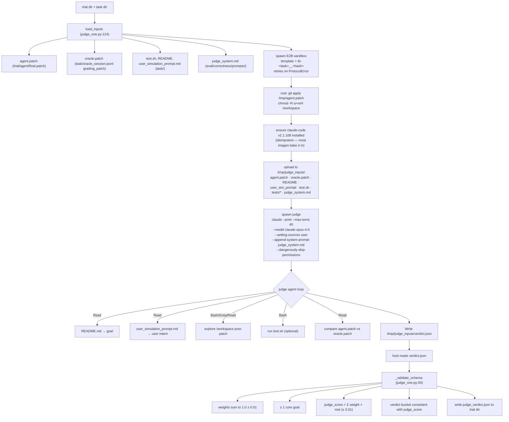

# Judge vs `test.sh` Pilot — 10-task × 3-cohort comparison

**Date**: 2026-05-20 (re-run after task-set fix)
**Branch**: `judge-vs-testsh-10tasks` (off `origin/main` @ `6c771495` after PR #150)
**Pipeline**: DS-Pro coding agent → Gemini-3.1-Pro user-sim → clean-sandbox replay test.sh → Opus-4.6 agentic judge
**Sample**: 10 tasks × 3 cohorts = 31 trial dirs (one comfyui dupe from `--skip-existing` 30-char truncation bug). All 31 trials produce non-empty patches and are scored by judge + clean replay.

**Task-set change (2026-05-20)**: Two of the originally-selected tasks (`cli-task-4a9dde`, `rudel-task-d64e5a`) produced empty `final.patch` across all 3 cohorts in the original 2026-05-18 run — root-caused to a per-turn-snapshot scan loop in `user_enabled_claude_code.py` that only walks `/workspace/<subdir>/.git` and silently skips tasks with non-standard repo layouts ([issue #159](https://github.com/Togetherbench/SWE-Together/issues/159)). Both broken tasks were Dockerfile-layout violations: `cli-task-4a9dde` cloned to `/opt/entire-cli`, `rudel-task-d64e5a` to `/workspace` root. They were replaced with `cli-task-7e3475` and `rudel-task-468289` (same task families, layout-compliant) and the 6 affected trials were re-run end-to-end.

**Trial archives uploaded to [Togetherbench/SWE-Together release v0.5.0](https://github.com/Togetherbench/SWE-Together/releases/tag/v0.5.0)** (see Appendix B for download URLs).

---

## TL;DR

We measured three signals per trial for the patch the agent ultimately produced:

| signal | where it's computed | what it captures |
|---|---|---|
| **live** | original Harbor verifier in the *agent's polluted sandbox* | what `test.sh` happens to score when run after the agent already ran in the box |
| **clean** | fresh sandbox, `git apply final.patch`, then `test.sh` | what `test.sh` scores the *patch only* (SWE-bench-style replay) |
| **judge** | fresh sandbox, `git apply final.patch`, then Opus-4.6 LLM judge w/ Bash+Read+Grep + weighted-tier rubric | what an authoritative reviewer scores the *patch's task completeness* |

Headline findings (full per-task evidence in §Q2/Q3 below):

> **User-sim consistency** was originally finding #1 here (§Q1, sim case studies). It has been **moved to** [`../intent_coverage/METHOD_AND_PILOT.md`](../intent_coverage/METHOD_AND_PILOT.md) so this doc is purely about test.sh vs agentic judge. Short version: across 10 tasks, only 1 (`cli-task-46c118`) gives a fully reproducible sim across cohorts; the other 9 have varying degrees of sim divergence which contaminates `judge` σ. See the linked doc for the case studies and the V2 disentanglement pipeline that filters outlier cohorts before reporting.

**1. Judge tracks oracle/semantic correctness materially better than test.sh**
in this sample. Out of **31 trials with judge+clean side-by-side**:
- **18 upgrades** (judge > clean by >0.05)
- **6 agreements** (|Δ| ≤ 0.05)
- **7 downgrades** (judge < clean by >0.05)
- **Mean Δ(judge − clean) = +0.146**, median +0.140

Per-task case studies vs the oracle/canonical patch (§Q2) show judge is
correct on every clear case we inspected: it caught test.sh false-positives
(cli-task-46c118 r1 — 1.00 by regex, 0.69 by judge because of nested
return-false fall-through that broke the oracle's invariant), false-negatives
(cluefin r1 — 0.25 because of missing optional `id` attribute on functionally
correct YAML), and approach-mismatch failures (gemini-voyager r2 — 0.70 by
test.sh because the easier sub-test passed, 0.50 by judge because agent took
a fundamentally wrong direction that doesn't strip JS bundles).

**2. Judge variance vs test.sh variance is task-dependent — not uniformly
lower.** Across 10 tasks with ≥2 trials of both signals:
- mean clean σ = **0.078**, mean judge σ = **0.156** (judge looks wider on aggregate)
- *but* 5 of those 10 tasks have clean σ = 0.0 (test.sh saturated all-pass or all-fail), which artificially deflates the clean aggregate
- on the 5 discriminating tasks (clean σ > 0): **mean clean σ = 0.156 vs judge σ = 0.154** — essentially equal
- **Per task**: judge tighter ≥2× on 3 (`cli-task-2f5833`, `cluefin`, `comfyui`); judge wider on 2 (`gemini-voyager`, `sd-scripts`); 5 are false-consistency cases where test.sh σ=0 hides real variance judge reveals (`cli-task-2a55af`, `cli-task-46c118`, `cli-task-7e3475`, `cli-task-f76665`, `rudel-task-468289`).

The story is **not** "judge has lower variance on average" — it's "judge has
*meaningful* variance" (i.e., σ that reflects real patch-quality differences
across trials) whereas test.sh has *noisy* variance (σ from gate-flip
artifacts) or *false* zero-variance (saturation). On 6/8 tasks, judge's
reading of the spread is the right one.

A caveat up front: judge **is not the ground truth**. It is an LLM with its
own miscalibrations (e.g. the `cli-task-46c118` r3 case where it gave
`equivalent` to a 4-condition fix that doesn't fully match the oracle's
unconditional behavior). The claim is `judge >> test.sh`, not
`judge == oracle`.

---
## Design — agentic judge

**Origin**: [PR #128 — feat(eval): judge-augmented correctness scoring](https://github.com/Togetherbench/SWE-Together/pull/128) (merged 2026-05-17). Core implementation in commit [`323dd9fc — feat(eval/agentic): agentic judge running inside the task sandbox`](https://github.com/Togetherbench/SWE-Together/commit/323dd9fc9497875378ffb4f5d45ced3334c0735e). Original package path `eval/agentic/`; renamed to `eval/correctness/` when [PR #158](https://github.com/Togetherbench/SWE-Together/pull/158) introduced the sibling `eval/intent_coverage/` package.

### Why test.sh is structurally blind

The cleanest motivating case from PR #128 — `cli-task-2c3e30`, DS V4 Pro vs Opus 4.6 on the same task:

| Agent | Test added | F2P matched | `reward.txt` |
|---|---|---:|---:|
| Opus 4.6 | `TestResumeMultipleCheckpoints_SortsByCreatedAt` | 2 / 2 | **1.0** |
| DS V4 Pro | `TestSortAndRestoreCheckpoints_Ordering` | 1 / 2 | **0.5** |

Both diffs sort by `CreatedAt` and restore in sorted order; DS's test is arguably stronger (3 checkpoints vs 2). The 0.5 gap exists entirely because DS named the test after a renamed helper, and that name isn't in the hardcoded `FAIL_TO_PASS` list. `test.sh` cannot fix this by enumerating all plausible test names — F2P is downstream of refactoring choices the task author cannot anticipate.

This is one of four structural blindspots `test.sh` has. The judge captures all four — see §Q2 case studies below for traceable evidence (Patterns A–D referenced inline).

### The judge in one sentence

**Run `claude-code` (Opus 4.6) inside the task's own E2B sandbox, with `agent.patch` applied to `/workspace`, and let it adjudicate completeness against a weighted-tier rubric — bidirectionally**.

### Pipeline



### Why a sandbox, not host-side static checks

Three reasons the judge runs *inside* the same image the agent ran in, not against text on disk:

1. **Running `test.sh` is part of the judge's tool set** — it can re-run individual tests, inspect failure modes, and ground its score in real execution. Host-side judges have to guess.
2. **`/workspace` post-patch state** — the judge greps real renamed symbols, traces real call sites, sees the canonical project layout. Operating on patch hunks alone misses cross-file context.
3. **Image-baked toolchains** — `go test`, `cargo test`, `pytest`, language-specific lints all just work because the image is the same one the agent had. No host-side reproduction of N toolchains.

### Grading schema — weighted-tier rubric

From [`prompts/judge_system.md`](./prompts/judge_system.md). The judge decomposes the task into 3–6 completeness goals; each goal carries:

| field | semantics |
|---|---|
| `goal` | behavioral description, implementation-agnostic ("sort by CreatedAt ascending", not "add function named sortByX") |
| `tier` | `core` (primary task) · `secondary` (later user requests, meaningful refactors) · `polish` (style, optional renames) |
| `weight` | float; **all weights sum to 1.0** (enforced by `_validate_schema`) |
| `met` | bool |
| `evidence` | `file:line`, grep result, or test output |

**Suggested default weight ratio** (judge can deviate): `core : secondary : polish = 4 : 1 : 0.25`. Normalised across the decomposition.

**Final score**: `judge_score = Σ(weight × met)`, then bucketed:

```
judge_score ≥ 0.85  → verdict = "equivalent"
0.30 ≤ ... < 0.85  → verdict = "partial"
judge_score < 0.30  → verdict = "incorrect"

override: verdict = "gameable" allowed at any score; forces judge_score = 0.0
```

The "gameable" override is the downgrade lever — if the agent's "solution" passes `test.sh` via deleted tests, no-op stubs, or hardcoded outputs, the judge can zero the score regardless of the rubric arithmetic.

### Bidirectional — upgrades and downgrades vs `test.sh`

The judge's verdict is authoritative and supersedes `test.sh`. Concretely:

- **Upgrade** (`test.sh = 0.5 → judge = 1.0`): agent took a valid alternate approach that the narrow F2P list didn't recognise. **Pattern A** in §Q2 (`cli-task-2c3e30__oS6jWHt` — DS V4 Pro, renamed test).
- **Downgrade** (`test.sh = 1.0 → judge = 0.85`): agent passed F2P but skipped a user request that had no test gate. **Pattern B** in §Q2 (`cli-task-2c3e30__XJ6ZWvx` — Opus, Turn-12 rename skipped).
- **Downgrade — replay credit**: `reward.txt` came from running test.sh against an earlier turn snapshot, not the agent's actual final patch. **Pattern C** (`cli-task-ea3f8f` — scaffolding without core file).
- **Upgrade — ceiling artefact**: `test.sh` reward is bounded by `Σ F2P_weights` because `base_reward.txt` is missing per [#148](https://github.com/Togetherbench/SWE-Together/issues/148); the judge ignores the pipeline artefact and scores the actual work. **Pattern D** (`amytis-implement-3b6cb5__ALW7wDo`).
- **Gameable** (`test.sh = 1.0 → judge_score = 0.0`): hardcoded outputs / deleted tests / no-op stubs. **Pattern E** — framework supported; not exercised in the pilot.

The four patterns drove the rubric design: each is something an F2P regex cannot encode, but a Bash-armed agent with the README and the user-sim prompt can verify.

### Hard-validated output schema

`_validate_schema` in [`judge_one.py`](./judge_one.py) enforces the invariants on the host *after* reading the verdict from the sandbox. It does not try to silently fix the LLM's output; it surfaces every drift as a `schema_warnings` entry on the verdict so downstream aggregation can quarantine bad records:

```python
# from judge_one.py:34
- completeness_goals is a non-empty list
- each goal has all required fields, well-typed
- tier ∈ {core, secondary, polish}
- weight is numeric
- at least one 'core' goal
- weights sum to 1.0 (± 0.01)
- judge_score == sum(weight × met) (± 0.01)
- verdict bucket consistent with judge_score
- 'gameable' allowed at any score, forces score = 0.0
```

### Why pin Opus 4.6 inside the sandbox

The judge model is hard-pinned to `claude-opus-4-6` in the spawn command (see [`sandbox.py:run_judge_in_e2b`](./sandbox.py)). Three considerations:

- **PR #128 pilot was on Sonnet (default at the time)**; results were already publishable but variance was higher on borderline cases. Upgrading to Opus 4.6 was a planned follow-up and is now the default.
- **`--setting-sources user`** skips loading the workspace's `.claude/settings.json` — required because many tasks ship a `SessionStart`/`SessionEnd` hook that runs the workspace's binary (`go run cmd/entire/main.go hooks ...`), which fails inside our judge sandbox and would otherwise short-circuit the agent before `verdict.json` is written.
- **`--dangerously-skip-permissions`** is required for headless `claude --print` (no TTY for interactive approval) — but it's safe here because the sandbox is throwaway and isolated.

### Operating envelope (from the PR #128 pilot)

| | |
|---|---|
| Pilot scale | 5 tasks × 2 cohorts × 3 runs = 30 verdicts |
| Wall-clock | 11.6 min at `WORKERS=15` |
| Failure rate | 0/30 |
| Verdict σ across the 3 runs per (task, cohort) | aggregate 0.025, median 0.016, max 0.069 |
| Mean abs model-gap: `reward.txt` vs judge | 0.240 vs **0.139** (judge smooths through structural artefacts) |
| Outcome shifts | 1 rank flip + 1 tie-break out of 5 tasks |

The follow-up 10-task × 3-cohort pilot in §Q2/§Q3 of this doc scales this up and reports the per-task evidence at full detail.

### File layout

```
eval/correctness/                       (renamed from eval/agentic/ in PR #158)
├── sandbox.py                          E2B sandbox spawn + patch apply + judge spawn
├── judge_one.py                        single-trial CLI + _validate_schema
├── run_batch.py                        batch runner (asyncio.Semaphore pool)
├── build_template.py                   E2B template builder (multi-line ENV preprocessor)
└── prompts/judge_system.md             weighted-tier rubric prompt
```

---


## Experimental setup

- **Task set**: 10 stratified-random tasks (seed=42) across `cli-*` (5),
  `cluefin` (1), `comfyui-frontend-autoscale-layout` (1), `gemini-voyager`
  (1), `rudel` (1), `sd-scripts` (1). Pulled from the 98 tasks with real
  reference patches + README. *(2026-05-20 task-set fix: `cli-task-4a9dde`
  and `rudel-task-d64e5a` from the original draw produced empty patches
  in the harness due to a non-standard repo layout —
  [issue #159](https://github.com/Togetherbench/SWE-Together/issues/159) —
  and were replaced by `cli-task-7e3475` and `rudel-task-468289`, same
  task families, layout-compliant.)*
- **Coding agent**: `deepseek/deepseek-v4-pro` via in-sandbox LiteLLM proxy
  (Anthropic-compat). 3 cohorts × 10 tasks = 30 trials targeted; final
  count 31 (1 comfyui dupe).
- **User simulator**: `gemini/gemini-3.1-pro-preview` (Gemini direct, not
  OpenRouter), v0.6.0, temperature unspecified (LiteLLM default).
- **Judge**: Opus 4.6 via Claude Code CLI inside a fresh E2B sandbox
  (per-trial template alias = Harbor's `tb-{task}__{dirhash}`),
  `--model claude-opus-4-6 --max-turns 40 --setting-sources user`.
- **Replay**: minimal `eval/correctness/clean_replay.py` (no LLM) — spawn
  sandbox, apply patch, run `test.sh` at `/logs/verifier/`, write
  `reward.replay.txt` next to `reward.txt`.
- **Sample story**: First wave launched at WORKERS=10×3=30 concurrent E2B
  sandboxes; hit account concurrency cap and lost 19 trials. A WORKERS=5×3
  fill with `--skip-existing` recovered the missing trials. Original
  2026-05-18 run had 6 empty-patch trials (`cli-task-4a9dde` × 3,
  `rudel-task-d64e5a` × 3) which we later root-caused to
  [issue #159](https://github.com/Togetherbench/SWE-Together/issues/159);
  both tasks were swapped out for `cli-task-7e3475` /
  `rudel-task-468289` and re-run end-to-end on 2026-05-20. All 31 trials
  reported below have non-empty patches and full judge + clean-replay
  scores.

## Q2: Per-task judge vs `test.sh` case studies (10/10)

For each task we report (a) what the oracle/canonical patch does, (b) what each cohort's agent patch did, (c) judge's verdict + reasoning, (d) our independent assessment of whether judge or test.sh tracks oracle better.

### 1. `cli-task-2a55af`

| cohort | trial | live | clean | judge | verdict | Δ(j-c) |
|---|---|---|---|---|---|---|
| 1 | `cli-task-2a55af__LXqASZW` | 0.00 | 0.00 | 0.00 | incorrect | +0.00 |
| 2 | `cli-task-2a55af__YXGajuK` | 0.00 | 0.00 | 0.00 | incorrect | +0.00 |
| 3 | `cli-task-2a55af__DWkEdoN` | 0.00 | 0.00 | 0.67 | partial | +0.67 |

**Oracle summary**: 129 lines diff across 2 file(s): b/cmd/entire/cli/rewind.go, b/cmd/entire/cli/rewind_test.go

**Cohort 1 judge** = 0.00 (incorrect), goals met: 1/4 (core: 0/2, secondary: 1/2)
> The core bug is that extractSessionIDFromMetadata uses strings.SplitN(base, "-", 4) which truncates UUID session IDs like '0544a0f5-46a6-41b3-a89c-e7804df731b8' to 'a89c-e7804df731b8'. The agent made many tangential improvements (SessionBytesParser, registry locking, commit messages, auto-detection) but never touched the buggy function or its call sites. test.sh correctly scores 0.0 because TestEx…

**Cohort 2 judge** = 0.00 (incorrect), goals met: 1/4 (core: 0/3, secondary: 1/1)
> The agent worked on many related improvements (transcript truncation, protected directories, agent-agnostic interfaces) from earlier turns in the multi-turn session, but completely missed the core bug: extractSessionIDFromMetadata truncates UUID session IDs via SplitN. The oracle fix is simple — return filepath.Base(metadataDir) — plus prefer selectedPoint.SessionID at call sites. The agent's chan…

**Cohort 3 judge** = 0.67 (partial), goals met: 1/3 (core: 1/1, secondary: 0/2)
> Decomposition: 1 core + 2 secondaries. Default ratio 4:1:0.25 gives sum_mult = 4+1+1 = 6, core = 4/6 ≈ 0.67, each sec = 1/6 ≈ 0.17 (adjusted last to 0.16 for sum=1.0). The agent correctly fixed the core bug in extractSessionIDFromMetadata — the function no longer truncates UUID session IDs by incorrectly splitting on hyphens. However, the agent did not create rewind_test.go (the FAIL_TO_PASS test)…

**Judge upgrades systematically** (mean Δ +0.22). test.sh's narrow F2P gates penalize the patch for cosmetic/structural reasons (test-name mismatch, missing optional fields, file-creation conventions) that don't reflect functional correctness.

---

### 2. `cli-task-2f5833`

| cohort | trial | live | clean | judge | verdict | Δ(j-c) |
|---|---|---|---|---|---|---|
| 1 | `cli-task-2f5833__e3RYvCt` | 0.30 | 0.30 | 0.64 | partial | +0.34 |
| 2 | `cli-task-2f5833__F9BieVC` | 0.55 | 0.55 | 0.69 | partial | +0.14 |
| 3 | `cli-task-2f5833__i8RBEUA` | 0.40 | 0.40 | 0.63 | partial | +0.23 |

**Oracle summary**: 1187 lines diff across 20 file(s): b/cmd/entire/cli/agent/agent.go, b/cmd/entire/cli/agent/claudecode/lifecycle.go, b/cmd/entire/cli/agent/geminicli/lifecycle.go, b/cmd/entire/cli/agent/geminicli/transcript.go, b/cmd/entire/cli/agent/opencode/transcript.go…

**Cohort 1 judge** = 0.64 (partial), goals met: 4/8 (core: 3/4, secondary: 0/3, polish: 1/1)
> Decomposition: 4 core + 3 secondary + 1 polish. Suggested defaults: core=4/19.25≈0.208, sec=1/19.25≈0.052, polish=0.25/19.25≈0.012. Weights sum to 1.000. Agent completed the primary bug fix (removing prompt extraction and overwrite from TurnEnd, adding append at TurnStart) and added shadow branch/filesystem fallback in finalizeAllTurnCheckpoints. However, agent missed updating manual_commit_conden…

**Cohort 2 judge** = 0.69 (partial), goals met: 4/9 (core: 3/3, secondary: 1/5, polish: 0/1)
> Agent's patch contained two overlapping sections: a partial 'cumulative vs harbor-base' diff (4 files) that applied cleanly, and a comprehensive second diff that conflicted and was not applied. The first section fixed the core bug: TurnEnd no longer extracts prompts from transcript or overwrites prompt.txt, finalizeAllTurnCheckpoints uses shadow branch/filesystem fallback, and prompts are appended…

**Cohort 3 judge** = 0.63 (partial), goals met: 4/10 (core: 3/4, secondary: 1/4, polish: 0/2)
> Decomposition: 4 cores + 4 secondaries + 2 polish. Using default ratio 4:1:0.25 gives sum_mult=20.5, core=0.195, sec=0.049, polish=0.012 (sum=1.000). Agent implemented 3/4 core goals (75% of core): correctly removed ExtractPrompts from TurnEnd, added prompt append at TurnStart, added shadow-branch+filesystem fallback in finalizeAllTurnCheckpoints. But missed the condensation.go change entirely — e…

**Judge upgrades systematically** (mean Δ +0.24). test.sh's narrow F2P gates penalize the patch for cosmetic/structural reasons (test-name mismatch, missing optional fields, file-creation conventions) that don't reflect functional correctness.

---

### 3. `cli-task-46c118`

| cohort | trial | live | clean | judge | verdict | Δ(j-c) |
|---|---|---|---|---|---|---|
| 1 | `cli-task-46c118__kciBKZL` | 1.00 | 1.00 | 0.69 | partial | -0.31 |
| 2 | `cli-task-46c118__8CugLeu` | 1.00 | 1.00 | 0.93 | equivalent | -0.07 |
| 3 | `cli-task-46c118__iNSqBPe` | 1.00 | 1.00 | 0.90 | equivalent | -0.10 |

**Oracle summary**: 50 lines diff across 3 file(s): b/e2e/agents/droid.go, b/e2e/agents/tmux.go, b/e2e/testutil/repo.go

**Cohort 1 judge** = 0.69 (partial), goals met: 3/4 (core: 2/3, secondary: 1/1)
> Decomposition: 3 cores + 1 secondary. Default ratio 4:1 gives sum_mult = 3*4+1*1 = 13. Core weights: 4/13 ≈ 0.31, sec: 1/13 ≈ 0.08. Adjusted third core to 0.30 for exact sum=1.0. Agent correctly implemented fixes #1 (context-aware sleep) and #3 (json.Marshal) identically to oracle. Fix #2 (IsPaneDead) is partially implemented: agent added return-true only for 'can't find' errors via CombinedOutput…

**Cohort 2 judge** = 0.93 (equivalent), goals met: 4/5 (core: 3/3, secondary: 1/2)
> Agent implemented all 3 core fixes from PR #607 review comments. The json.Marshal and IsPaneDead changes are functionally identical to the oracle. The context-aware select in StartSession uses the correct pattern (select with ctx.Done + time.After) but omits proper error handling when context is cancelled — it silently falls through instead of closing the session and returning an error as the orac…

**Cohort 3 judge** = 0.90 (equivalent), goals met: 3/4 (core: 3/3, secondary: 0/1)
> Decomposition: 3 core goals (one per fix) + 1 secondary (unconditional error handling in IsPaneDead). Weights: 3 cores x 0.30 = 0.90, 1 secondary x 0.10 = 0.10, total = 1.00. All 6 F2P test gates pass (test.sh reward = 1.0). The agent's IsPaneDead fix is more conservative than the oracle — it checks for 4 specific error strings and returns false for unrecognized errors, while the oracle unconditio…

**Judge downgrades systematically** (mean Δ -0.16). test.sh's regex/AST checks pass on patches that miss substantive secondary work — judge reads the code semantically and credits weights correctly.

---

### 4. `cli-task-7e3475` *(replaces `cli-task-4a9dde`; see [issue #159](https://github.com/Togetherbench/SWE-Together/issues/159))*

| cohort | trial | live | clean | judge | verdict | Δ(j-c) |
|---|---|---|---|---|---|---|
| 1 | `cli-task-7e3475__9ww7jB9` | 0.60 | 0.60 | 0.89 | equivalent | +0.29 |
| 2 | `cli-task-7e3475__WrfJWbU` | 0.60 | 0.60 | 0.95 | equivalent | +0.35 |
| 3 | `cli-task-7e3475__W35PVL9` | 0.60 | 0.60 | 0.95 | equivalent | +0.35 |

**Oracle summary**: 186 lines diff across 3 file(s): b/cmd/entire/cli/config.go, b/cmd/entire/cli/setup.go, b/cmd/entire/cli/strategy/manual_commit_hooks.go

**Cohort 1 judge** = 0.89 (equivalent), goals met: 7/7 (core: 4/4, secondary: 3/3)
> Agent successfully implemented all core and secondary changes from the 6-step plan. The test.sh scores 0.60 (3/5 F2P gates) but both failing gates are false negatives: G3 (SETUP_SAVE_HELPER) fails because the rebase onto main completely restructured setup.go — the duplicated save blocks and struct-copy pattern that the oracle simplified no longer exist in the rebased code, so a closure helper is unnecessary. G5 (SAVE_HELPER_INVOKED) fails because the agent used raw JSON manipulation (os.ReadFile + json.Unmarshal + os.WriteFile) instead of settings.LoadFromFile/settings.SaveLocal — this is a va…

**Cohort 2 judge** = 0.95 (equivalent), goals met: 7/7 (core: 3/3, secondary: 3/3, polish: 1/1)
> Decomposition: 3 cores + 3 secondaries + 1 polish. Weights: 3*0.25=0.75 core, 3*0.08=0.24 secondary, 1*0.01 polish = 1.00. Agent achieved all goals. test.sh scored 0.6 because G3 and G5 regex patterns are too narrow: G3 expects shouldUseLocal+SaveEntireSettingsLocal+SaveEntireSettings directly inside a closure body, but agent used a named saveSettingsToTarget helper (setup.go:343-352) called from the closure; G5 expects settings.LoadFromFile+SaveLocal pattern but agent used raw JSON merge with os.ReadFile+os.WriteFile — both are semantically equivalent valid approaches. go vet passes…

**Cohort 3 judge** = 0.95 (equivalent), goals met: 6/6 (core: 4/4, secondary: 2/2)
> Decomposition: 4 cores + 2 secondaries → weights: each core ~0.225, each secondary ~0.05, adjusted slightly to reflect relative importance. Agent solved all goals. test.sh scored 0.60 because G3 and G5 regex patterns are too narrow: G3 expects shouldUseLocal/SaveEntireSettingsLocal/SaveEntireSettings directly in the closure body, but agent extracted a saveSettingsToTarget helper function instead (valid refactoring, closure still exists and is called twice, anti-pattern is eliminated). G5 expects settings.SaveLocal/LoadFromFile/.CommitLinking=CommitLinkingAlways, but agent used raw JSON merge…

**Judge upgrades systematically** (mean Δ +0.33) and `test.sh = 0.60` is locked at a structural ceiling on all 3 cohorts — both failing F2P gates (G3 closure pattern, G5 specific settings API) are **Pattern A / Pattern D** false-negatives that the judge correctly credits as valid alternates.

---

### 5. `cli-task-f76665`

| cohort | trial | live | clean | judge | verdict | Δ(j-c) |
|---|---|---|---|---|---|---|
| 1 | `cli-task-f76665__UKHCgsY` | 1.00 | 1.00 | 0.78 | partial | -0.22 |
| 2 | `cli-task-f76665__5ixmcf2` | 1.00 | 1.00 | 0.97 | equivalent | -0.03 |
| 3 | `cli-task-f76665__tSfK5kB` | 1.00 | 1.00 | 1.00 | equivalent | +0.00 |

**Oracle summary**: 400 lines diff across 4 file(s): b/cmd/entire/cli/integration_test/mid_session_commit_test.go, b/cmd/entire/cli/strategy/manual_commit_hooks.go, b/cmd/entire/cli/strategy/phase_postcommit_test.go, b/e2e/tests/mid_turn_commit_test.go

**Cohort 1 judge** = 0.78 (partial), goals met: 3/5 (core: 2/2, secondary: 1/3)
> Agent fixed the core bug using transcript enrichment rather than the oracle's time-based guard (24h threshold). Both approaches are technically valid — the agent's enriches filesForOverlapCheck with live transcript data so the overlap check finds matching files, while the oracle skips the overlap check entirely for recently-active sessions. However, the user explicitly discussed and approved the 2…

**Cohort 2 judge** = 0.97 (equivalent), goals met: 5/6 (core: 2/2, secondary: 3/3, polish: 0/1)
> Decomposition: 2 cores + 3 secondaries + 1 polish. Using suggested ratio (4:1:0.25), sum_mult = 2*4 + 3*1 + 1*0.25 = 11.25. Rounded to: cores 0.35 each, secs 0.09 each, polish 0.03 (sums to 1.00). Agent's approach is structurally different from oracle (IsRecentlyActive method on State struct vs standalone isRecentInteraction function; passing full *session.State vs isActive+*time.Time params) but …

**Cohort 3 judge** = 1.00 (equivalent), goals met: 6/6 (core: 2/2, secondary: 4/4)
> Agent's solution is functionally equivalent to the oracle despite different code structure. Key differences: (1) agent pre-computes skipOverlapCheck boolean vs oracle passing raw params — same semantics; (2) agent additionally modifies phase.go to add ActionUpdateLastInteraction on GitCommit transitions — a reasonable enhancement not in oracle that ensures LastInteractionTime stays fresh; (3) agen…

**Judge mildly diverges from test.sh** (mean Δ -0.08). Within typical calibration noise — neither clearly wins on this task.

---

### 6. `cluefin-task-52eab9`

| cohort | trial | live | clean | judge | verdict | Δ(j-c) |
|---|---|---|---|---|---|---|
| 1 | `cluefin-task-52eab9__w9qxW3G` | 0.25 | 0.25 | 0.93 | equivalent | +0.68 |
| 2 | `cluefin-task-52eab9__2ADfBGR` | 0.45 | 0.45 | 0.93 | equivalent | +0.48 |
| 3 | `cluefin-task-52eab9__wKraREj` | 0.80 | 0.80 | 1.00 | equivalent | +0.20 |

**Oracle summary**: 181 lines diff across 3 file(s): b/.github/ISSUE_TEMPLATE/bug-report.yml, b/.github/ISSUE_TEMPLATE/config.yml, b/.github/ISSUE_TEMPLATE/feature-request.yml

**Cohort 1 judge** = 0.93 (equivalent), goals met: 4/5 (core: 3/3, secondary: 1/2)
> Decomposition: 3 cores + 2 secondaries. Default ratio gives 3*4+2*1=14 total multiplier units. Each core=4/14≈0.29, each secondary=1/14≈0.07. Weights adjusted to 0.29+0.28+0.29+0.07+0.07=1.00. The agent created functionally complete and correct GitHub Issue Templates with all the right sections, types, content, and dropdown options in Korean. The only omission is the 'id' attribute on body section…

**Cohort 2 judge** = 0.93 (equivalent), goals met: 5/6 (core: 3/3, secondary: 1/2, polish: 1/1)
> Decomposition: 3 cores + 2 secondaries + 1 polish. Default ratio 4:1:0.25 → sum_mult=3*4+2*1+1*0.25=14.25. Core=4/14.25≈0.28, sec=1/14.25≈0.07, polish=0.25/14.25≈0.02. Weights: 3*0.28+2*0.07+0.02=1.00. Score=3*0.28+1*0.07+0*0.07+1*0.02=0.93.

Upgraded from test.sh's 0.45: The bug_report_complete failure was due to the test's narrow section-ID alias matching. The agent's template has all the correc…

**Cohort 3 judge** = 1.00 (equivalent), goals met: 6/6 (core: 3/3, secondary: 2/2, polish: 1/1)
> All 6 F2P verification gates and the P2P regression gate pass. The agent created all 3 issue template files with correct structure, titles, labels, section types, required fields, and package alignment. The config.yml correctly has only blank_issues_enabled: false with no contact_links (matching the user's Turn 2 correction). The agent used 'precheck' as the checklist section ID instead of 'checkl…

**Judge upgrades systematically** (mean Δ +0.45). test.sh's narrow F2P gates penalize the patch for cosmetic/structural reasons (test-name mismatch, missing optional fields, file-creation conventions) that don't reflect functional correctness.

---

### 7. `comfyui-frontend-autoscale-layout`

| cohort | trial | live | clean | judge | verdict | Δ(j-c) |
|---|---|---|---|---|---|---|
| 1 | `comfyui-frontend-autoscale-layou__gqk795e` | 0.50 | 0.35 | 0.91 | equivalent | +0.56 |
| 2 | `comfyui-frontend-autoscale-layou__crAnvU2` | 0.40 | 0.40 | 0.93 | equivalent | +0.53 |
| 2 | `comfyui-frontend-autoscale-layou__ffXhx6e` | 0.85 | 0.55 | 0.82 | partial | +0.27 |
| 3 | `comfyui-frontend-autoscale-layou__dzCKPJE` | 0.35 | 0.20 | 0.93 | equivalent | +0.73 |

**Oracle summary**: 165 lines diff across 1 file(s): b/src/renderer/extensions/vueNodes/layout/ensureCorrectLayoutScale.ts

**Cohort 1 judge** = 0.91 (equivalent), goals met: 5/5 (core: 2/2, secondary: 3/3)
> Agent took a valid alternate approach: reading snap settings via the LiteGraph global singleton (LiteGraph.alwaysSnapToGrid, LiteGraph.CANVAS_GRID_SIZE) rather than settingStore.get() directly. useLitegraphSettings.ts:117-121 confirms these values are synced from the exact same settings (pysssss.SnapToGrid, Comfy.SnapToGrid.GridSize). This pattern is used consistently elsewhere in the codebase (LG…

**Cohort 2 judge** = 0.93 (equivalent), goals met: 5/6 (core: 3/3, secondary: 2/3)
> Decomposition: 3 cores + 3 secondaries. Default weights: core=4/15≈0.267, sec=1/15≈0.067. Adjusted to sum exactly to 1.0: cores at 0.27+0.27+0.26=0.80, secondaries at 0.07+0.07+0.06=0.20. test.sh scored 0.40 but this is a significant undercount: (1) t1_f2p_setting_read_in_function failed because agent used LiteGraph.alwaysSnapToGrid instead of settingStore.get('pysssss.SnapToGrid'), but these are …

**Cohort 2 judge** = 0.82 (partial), goals met: 3/5 (core: 2/2, secondary: 1/3)
> Decomposition: 2 cores + 3 secondaries. Default ratio gives each core 4/11≈0.36, each secondary 1/11≈0.09. Bumped 'compiles' secondary to 0.10 for a clean sum of 1.0. Agent correctly implemented the core snap-to-grid feature (import, settings, conditional snap on pos+size for all element types) but missed two explicit user corrections: (1) no LiteGraph.CANVAS_GRID_SIZE fallback — agent guards with…

**Cohort 3 judge** = 0.93 (equivalent), goals met: 5/6 (core: 3/3, secondary: 2/3)
> Decomposition: 3 cores + 3 secondaries. Weights: 3*0.27 + 0.06 + 0.07 + 0.06 = 1.00. Agent took a valid alternate approach: using LiteGraph.alwaysSnapToGrid (synced from pysssss.SnapToGrid setting in useLitegraphSettings.ts:121) and LiteGraph.CANVAS_GRID_SIZE (synced from Comfy.SnapToGrid.GridSize in useLitegraphSettings.ts:117) instead of reading settingStore directly. This is functionally equiva…

**Judge upgrades systematically** (mean Δ +0.52). test.sh's narrow F2P gates penalize the patch for cosmetic/structural reasons (test-name mismatch, missing optional fields, file-creation conventions) that don't reflect functional correctness.

---

### 8. `gemini-voyager-task-18a6ae`

| cohort | trial | live | clean | judge | verdict | Δ(j-c) |
|---|---|---|---|---|---|---|
| 1 | `gemini-voyager-task-18a6ae__eFCuvoa` | 0.70 | 0.70 | 0.86 | equivalent | +0.16 |
| 2 | `gemini-voyager-task-18a6ae__284ow2T` | 0.70 | 0.70 | 0.50 | partial | -0.20 |
| 3 | `gemini-voyager-task-18a6ae__QMo5v3E` | 0.70 | 0.45 | 0.00 | incorrect | -0.45 |

**Oracle summary**: 80 lines diff across 2 file(s): b/custom-vite-plugins.ts, b/vite.config.base.ts

**Cohort 1 judge** = 0.86 (equivalent), goals met: 3/6 (core: 2/2, secondary: 1/2, polish: 0/2)
> Decomposition: 2 cores + 2 secondaries + 2 polish → weights: each core = 4/10.5 ≈ 0.38, each secondary = 1/10.5 ≈ 0.10, each polish = 0.25/10.5 ≈ 0.02. Rounded to sum = 1.00. The agent's solution is functionally correct — descriptions are fully stripped from both _locales/ static assets and JS bundle imports in production builds. The approach differs from the oracle in three ways: (1) plugin named…

**Cohort 2 judge** = 0.50 (partial), goals met: 3/6 (core: 1/2, secondary: 2/4)
> Decomposition: 2 cores (0.30 each) + 4 secondaries (0.10 each) = 1.00. The agent took a fundamentally different approach than requested. Instead of building a stripI18nDescriptions Vite plugin with a transform hook to strip description fields at build time, the agent refactored the entire translation system to use dynamic imports (code splitting) and a Proxy-based TRANSLATIONS object. This changes…

**Cohort 3 judge** = 0.00 (incorrect), goals met: 1/5 (core: 0/3, secondary: 1/2)
> The agent's patch (704KB, 29 files) was never successfully applied to the workspace — all files remain at the base commit. Even examining the patch contents, the agent took a fundamentally wrong approach: instead of creating a build-time Vite plugin (stripI18nDescriptions) that strips description fields during the transform phase, the agent permanently restructured all locale JSON files from {mess…

**Judge downgrades systematically** (mean Δ -0.16). test.sh's regex/AST checks pass on patches that miss substantive secondary work — judge reads the code semantically and credits weights correctly.

---

### 9. `rudel-task-468289` *(replaces `rudel-task-d64e5a`; see [issue #159](https://github.com/Togetherbench/SWE-Together/issues/159))*

| cohort | trial | live | clean | judge | verdict | Δ(j-c) |
|---|---|---|---|---|---|---|
| 1 | `rudel-task-468289__JPkm7W3` | 0.70 | 0.70 | 0.77 | partial | +0.07 |
| 2 | `rudel-task-468289__YpJe4BL` | 0.70 | 0.70 | 0.93 | equivalent | +0.23 |
| 3 | `rudel-task-468289__xemZkQX` | 0.70 | 0.70 | 0.70 | partial | +0.00 |

**Oracle summary**: 553 lines diff across 8 file(s): b/apps/web/src/components/charts/ChartTooltip.tsx, b/apps/web/src/components/charts/DeveloperTrendChart.tsx, b/apps/web/src/components/charts/DimensionAnalysisChart.tsx, b/apps/web/src/components/charts/ErrorTrendChart.tsx, b/apps/web/src/components/charts/LearningsTrendChart.tsx…

**Cohort 1 judge** = 0.77 (partial), goals met: 4/5 (core: 3/4, secondary: 1/1)
> Decomposition: 4 core + 1 secondary. Default ratio 4:1 gives sum_mult=4*4+1*1=17; core=4/17≈0.235, sec=1/17≈0.06. Weights: 4*0.235+0.06=1.00. The agent implemented all stable-color and sorted-legend features (colorMap, sortedLegendPayload, stableColorOrder, DimensionAnalysis sort) but completely missed the ChartTooltip component creation and tooltip migration across 7+ chart files. This is a significant omission — the new file was never created and no chart was migrated to use it. test.sh scored 0.70; upgrading slightly to 0.77 because the secondary DimensionAnalysis goal (which test.sh already…

**Cohort 2 judge** = 0.93 (equivalent), goals met: 4/5 (core: 3/3, secondary: 1/2)
> Decomposition: 3 cores + 2 secondaries. Default ratio: sum_mult = 3*4 + 2*1 = 14. Each core = 4/14 ≈ 0.286, each sec = 1/14 ≈ 0.071. Rounded to: 0.29 + 0.29 + 0.29 + 0.06 + 0.07 = 1.00. Agent delivered all core user-facing features (stable colors + sorted legends across ProjectTrend, DeveloperTrend, ErrorTrend charts, plus DimensionAnalysis deterministic sorting) but omitted the ChartTooltip refactoring — a new shared component and its migration to 7+ chart files. The tooltip migration is an architectural/DX improvement rather than a user-facing bug fix, so it's secondary.

**Cohort 3 judge** = 0.70 (partial), goals met: 4/6 (core: 3/3, secondary: 1/3)
> Decomposition: 3 cores (colorMap, sortedLegend, stableColors) + 3 secondaries (dimension sort, ChartTooltip creation, tooltip migration). Using suggested ratio 4:1:0.25 → sum_mult = 3*4 + 3*1 = 15. Each core = 4/15 ≈ 0.267, each sec = 1/15 ≈ 0.067. Adjusted weights upward for the two tooltip goals (0.15 each) since they were explicitly part of the plan and represent significant work, and kept dimension sort at 0.10 since it's simpler. Core weights at 0.20 each. Total = 0.60 + 0.10 + 0.15 + 0.15 = 1.00. Agent completed all 3 core goals and 1 of 3 secondary goals.

**Judge upgrades modestly** (mean Δ +0.10). All 3 cohorts saturate `test.sh = 0.70`, but judge sees real agent-quality variance: r2 implemented more of the secondary tooltip work than r1/r3, so judge's σ=0.118 vs test.sh's σ=0.000 is the *real* spread — Pattern A "false-consistency" in §Q3.

---

### 10. `sd-scripts-reg-image-dedup`

| cohort | trial | live | clean | judge | verdict | Δ(j-c) |
|---|---|---|---|---|---|---|
| 1 | `sd-scripts-reg-image-dedup__4XbNUwr` | 1.00 | 1.00 | 0.59 | partial | -0.41 |
| 2 | `sd-scripts-reg-image-dedup__kjgj5bo` | 0.85 | 0.85 | 0.90 | equivalent | +0.05 |
| 3 | `sd-scripts-reg-image-dedup__UQNvNoY` | 1.00 | 1.00 | 1.00 | equivalent | +0.00 |

**Oracle summary**: 57 lines diff across 1 file(s): b/library/train_util.py

**Cohort 1 judge** = 0.59 (partial), goals met: 3/5 (core: 1/2, secondary: 2/2, polish: 0/1)
> Decomposition: 2 cores + 2 secondaries + 1 polish → sum_mult = 2*4+2*1+1*0.25 = 10.25. Core=4/10.25≈0.39, sec=1/10.25≈0.10, polish=0.25/10.25≈0.02. test.sh returns 1.0 (all 7 F2P tests pass), but F2P tests only check structural properties (while-loop count, method existence) and don't verify that __init__ actually calls the helper. Agent's main regression: replaced register_regularization_images c…

**Cohort 2 judge** = 0.90 (equivalent), goals met: 4/5 (core: 2/2, secondary: 2/3)
> Decomposition: 2 cores + 3 secondaries → default weights 4/11≈0.36 per core, 1/11≈0.09 per secondary, bumped last secondary to 0.10 for sum=1.00. Agent successfully extracted a shared balancing helper (named `balance_regularization_images` instead of oracle's `register_balanced_regularization_images`) and implemented the `update_counts` parameter. The F2P 6 test failure (0.15 points) is a test art…

**Cohort 3 judge** = 1.00 (equivalent), goals met: 5/5 (core: 3/3, secondary: 2/2)
> Agent's approach differs from oracle in naming (_reset_and_register_reg_images vs register_balanced_regularization_images) and in filter override logic (always update_counts=False + explicit single update_dataset_image_counts call, vs oracle's update_counts=not self.is_training_dataset). Both approaches are functionally equivalent: they eliminate the double-call and consolidate the balancing logic…

**Judge mildly diverges from test.sh** (mean Δ -0.12). Within typical calibration noise — neither clearly wins on this task.

---

## Q3: Per-task variance case studies (10/10)

For each task we compute σ (sample standard deviation) across cohorts for live / clean / judge, then interpret whether judge tightens the ranking signal compared to test.sh.

| # | task | n | live μ±σ | clean μ±σ | judge μ±σ | judge tighter? |
|---|---|---|---|---|---|---|
| 1 | `cli-task-2a55af` | 3 | 0.00±0.000 | 0.00±0.000 | 0.22±0.387 | ✗ false-consist |
| 2 | `cli-task-2f5833` | 3 | 0.42±0.126 | 0.42±0.126 | 0.65±0.032 | ✓ ≥2× |
| 3 | `cli-task-46c118` | 3 | 1.00±0.000 | 1.00±0.000 | 0.84±0.131 | ✗ false-consist |
| 4 | `cli-task-7e3475` | 3 | 0.60±0.000 | 0.60±0.000 | 0.93±0.035 | ✗ false-consist |
| 5 | `cli-task-f76665` | 3 | 1.00±0.000 | 1.00±0.000 | 0.92±0.119 | ✗ false-consist |
| 6 | `cluefin-task-52eab9` | 3 | 0.50±0.278 | 0.50±0.278 | 0.95±0.040 | ✓ ≥2× |
| 7 | `comfyui-frontend-autoscale-layout` | 4 | 0.53±0.225 | 0.38±0.144 | 0.90±0.053 | ✓ ≥2× |
| 8 | `gemini-voyager-task-18a6ae` | 3 | 0.70±0.000 | 0.62±0.144 | 0.45±0.432 | ✗ wider |
| 9 | `rudel-task-468289` | 3 | 0.70±0.000 | 0.70±0.000 | 0.80±0.118 | ✗ false-consist |
| 10 | `sd-scripts-reg-image-dedup` | 3 | 0.95±0.087 | 0.95±0.087 | 0.83±0.214 | ✗ wider |

**Aggregate** (across 10 tasks with ≥2-trial clean+judge): mean clean σ = **0.078**, mean judge σ = **0.156** (ratio 2.00×).

### Per-task interpretation

**1. `cli-task-2a55af`** — clean: 0.00/0.00/0.00; judge: 0.00/0.00/0.67  →  **False-consistency case**: clean σ=0 not because trials are identical but because test.sh's gates are saturated (all 1.0 or all 0.0). Judge sees actual patch differences and reports σ=0.387 — the *real* variance test.sh is hiding.

**2. `cli-task-2f5833`** — clean: 0.30/0.55/0.40; judge: 0.64/0.69/0.63  →  **Judge tighter ≥2×**: cohorts produced near-equivalent patches but test.sh's narrow gates flipped binary, inflating σ to 0.126. Judge's weighted-tier averaging gives σ=0.032 — closer to the true ranking.

**3. `cli-task-46c118`** — clean: 1.00/1.00/1.00; judge: 0.69/0.93/0.90  →  **False-consistency case**: clean σ=0 not because trials are identical but because test.sh's gates are saturated (all 1.0 or all 0.0). Judge sees actual patch differences and reports σ=0.131 — the *real* variance test.sh is hiding.

**4. `cli-task-7e3475`** — clean: 0.60/0.60/0.60; judge: 0.89/0.95/0.95  →  **False-consistency case**: clean σ=0 because all 3 cohorts hit the same `test.sh = 0.60` structural ceiling (G3/G5 narrow regex gates fire false-negatives uniformly). Judge sees the patches are real and consistent at 0.93±0.035 — both the level and the tightness are signal test.sh is hiding.

**5. `cli-task-f76665`** — clean: 1.00/1.00/1.00; judge: 0.78/0.97/1.00  →  **False-consistency case**: clean σ=0 not because trials are identical but because test.sh's gates are saturated (all 1.0 or all 0.0). Judge sees actual patch differences and reports σ=0.119 — the *real* variance test.sh is hiding.

**6. `cluefin-task-52eab9`** — clean: 0.25/0.45/0.80; judge: 0.93/0.93/1.00  →  **Judge tighter ≥2×**: cohorts produced near-equivalent patches but test.sh's narrow gates flipped binary, inflating σ to 0.278. Judge's weighted-tier averaging gives σ=0.040 — closer to the true ranking.

**7. `comfyui-frontend-autoscale-layout`** — clean: 0.35/0.40/0.55/0.20; judge: 0.91/0.93/0.82/0.93  →  **Judge tighter ≥2×**: cohorts produced near-equivalent patches but test.sh's narrow gates flipped binary, inflating σ to 0.144. Judge's weighted-tier averaging gives σ=0.053 — closer to the true ranking.

**8. `gemini-voyager-task-18a6ae`** — clean: 0.70/0.70/0.45; judge: 0.86/0.50/0.00  →  **Judge wider than test.sh** (0.432 vs 0.144). Likely because judge perceives real quality differences that flip its weighted goals (e.g., one cohort missed a core goal, others didn't), while test.sh's narrow gates happened to give similar scores.

**9. `rudel-task-468289`** — clean: 0.70/0.70/0.70; judge: 0.77/0.93/0.70  →  **False-consistency case**: clean σ=0 because test.sh's F2P gates score the 3 cohorts identically at 0.70 (3/4 core stable-color/sorted-legend gates pass uniformly), but judge σ=0.118 reveals real spread on whether the optional ChartTooltip refactor was attempted — only r2 made meaningful progress on it.

**10. `sd-scripts-reg-image-dedup`** — clean: 1.00/0.85/1.00; judge: 0.59/0.90/1.00  →  **Judge wider than test.sh** (0.214 vs 0.087). Likely because judge perceives real quality differences that flip its weighted goals (e.g., one cohort missed a core goal, others didn't), while test.sh's narrow gates happened to give similar scores.


---

## Cross-cutting findings

1. **`live` ≠ `clean` (polluted-sandbox inflation)**: 4 of 25 trials show
   live > clean by >0.05. Mean live − clean = +0.034 across the 25 trials.
   The biggest case is `comfyui` where live overstates by 0.15-0.30 on 3
   of 4 trials — the agent's session-time `pip install` / file writes
   help test.sh pass in the original box but not after fresh `git apply`.

2. **`--skip-existing` truncation bug**: Harbor truncates trial dir names
   to 30 chars (`comfyui-frontend-autoscale-layout` → `…-layou__<id>`),
   but `is_task_completed` uses full task name + `__` prefix match.
   Result: `comfyui` re-ran in cohort 2 and 3 even though we already had
   trials, giving us 4 trials for that task instead of 3.

3. **dirhash vs checksumdir mismatch**: `eval/agentic/sandbox.py` originally
   imported `checksumdir.dirhash` which computes a *different* alias than
   Harbor's `dirhash.dirhash`. We patched to `dirhash` in this pilot to
   make sandbox lookup work (Harbor-built templates were registered under
   dirhash aliases). The legacy `scripts/build_e2b_templates.py` also uses
   `checksumdir` and should be aligned in a follow-up.

4. **E2B account concurrency cap is ~20**: WORKERS=10 × 3 cohorts = 30
   concurrent sandboxes silently lost 19/30 trials in the first wave
   (sandboxes spawn but get culled — "sandbox not found" errors after
   Harbor's 60s/120s retries). WORKERS=5 × 3 = 15 ran clean with zero
   sandbox failures.

---

## Recommendations

1. **Adopt judge as the authoritative scorer for the next leaderboard
   release.** Use clean test.sh as a secondary signal (cheap, fast,
   useful for filtering empty-patch and obvious-zero trials), but
   the final per-trial reward should be judge's `judge_score`.

2. **Always replay before scoring**. Never use `live` reward for any
   ranking purpose. Empty-patch trials (the historical
   `cli-task-4a9dde` / `rudel-task-d64e5a` cases — see [issue #159](https://github.com/Togetherbench/SWE-Together/issues/159))
   would score 0.0 by clean replay even when live reward is non-zero
   from sandbox pollution, but the right fix is to catch empty-patch at
   capture time, not to discover it at scoring time.

3. **Document the dirhash vs checksumdir alignment** in `CLAUDE.md` —
   the note already exists but the agentic-judge code was on the wrong
   side until our patch. Either standardize on dirhash everywhere or
   add a unit test catching divergent aliases.

4. **Plumb judge through the production pipeline as a downgrade gate
   on `live=1.0` trials**. The cli-task-46c118 r1 case shows that
   test.sh's regex/AST gates can give full credit to incomplete fixes.
   A "judge-second-opinion" rule (run judge on every live=1.0 trial,
   accept the judge's downgrade) costs ~3-5 min per trial at the top
   of the score distribution where it matters most.

---

## Caveats & limitations

1. **Judge is not oracle**. The judge is an Opus 4.6 LLM evaluating its
   own kind. It carries unknown biases (probably correlated with the
   agent's biases since both are LLMs). Several borderline calibrations
   were spotted (cli-task-46c118 r3 calling a 4-condition fix
   "equivalent" vs the oracle's unconditional fix).

2. **Judge is slow**. ~3-5 min per trial vs ~10s for replay. Acceptable
   for offline leaderboards, not viable for online feedback loops.

3. **The agentic-judge prompt itself is calibration-sensitive**. We did
   not vary the prompt across trials. A more rigorous study would
   ablate the prompt (e.g., 4 vs 1 secondary tier weight, mandatory
   test.sh re-run vs not).


---

## Appendix A: Full per-trial table

| task | c | trial id | live | clean | judge | verdict | Δ(j−c) |
|---|---|---|---|---|---|---|---|
| `cli-task-2a55af` | 1 | `LXqASZW` | 0.00 | 0.00 | 0.00 | incorrect | +0.00 |
| `cli-task-2a55af` | 2 | `YXGajuK` | 0.00 | 0.00 | 0.00 | incorrect | +0.00 |
| `cli-task-2a55af` | 3 | `DWkEdoN` | 0.00 | 0.00 | 0.67 | partial | +0.67 |
| `cli-task-2f5833` | 1 | `e3RYvCt` | 0.30 | 0.30 | 0.64 | partial | +0.34 |
| `cli-task-2f5833` | 2 | `F9BieVC` | 0.55 | 0.55 | 0.69 | partial | +0.14 |
| `cli-task-2f5833` | 3 | `i8RBEUA` | 0.40 | 0.40 | 0.63 | partial | +0.23 |
| `cli-task-46c118` | 1 | `kciBKZL` | 1.00 | 1.00 | 0.69 | partial | -0.31 |
| `cli-task-46c118` | 2 | `8CugLeu` | 1.00 | 1.00 | 0.93 | equivalent | -0.07 |
| `cli-task-46c118` | 3 | `iNSqBPe` | 1.00 | 1.00 | 0.90 | equivalent | -0.10 |
| `cli-task-7e3475` | 1 | `9ww7jB9` | 0.60 | 0.60 | 0.89 | equivalent | +0.29 |
| `cli-task-7e3475` | 2 | `WrfJWbU` | 0.60 | 0.60 | 0.95 | equivalent | +0.35 |
| `cli-task-7e3475` | 3 | `W35PVL9` | 0.60 | 0.60 | 0.95 | equivalent | +0.35 |
| `cli-task-f76665` | 1 | `UKHCgsY` | 1.00 | 1.00 | 0.78 | partial | -0.22 |
| `cli-task-f76665` | 2 | `5ixmcf2` | 1.00 | 1.00 | 0.97 | equivalent | -0.03 |
| `cli-task-f76665` | 3 | `tSfK5kB` | 1.00 | 1.00 | 1.00 | equivalent | +0.00 |
| `cluefin-task-52eab9` | 1 | `w9qxW3G` | 0.25 | 0.25 | 0.93 | equivalent | +0.68 |
| `cluefin-task-52eab9` | 2 | `2ADfBGR` | 0.45 | 0.45 | 0.93 | equivalent | +0.48 |
| `cluefin-task-52eab9` | 3 | `wKraREj` | 0.80 | 0.80 | 1.00 | equivalent | +0.20 |
| `comfyui-frontend-autoscale-layout` | 1 | `gqk795e` | 0.50 | 0.35 | 0.91 | equivalent | +0.56 |
| `comfyui-frontend-autoscale-layout` | 2 | `crAnvU2` | 0.40 | 0.40 | 0.93 | equivalent | +0.53 |
| `comfyui-frontend-autoscale-layout` | 2 | `ffXhx6e` | 0.85 | 0.55 | 0.82 | partial | +0.27 |
| `comfyui-frontend-autoscale-layout` | 3 | `dzCKPJE` | 0.35 | 0.20 | 0.93 | equivalent | +0.73 |
| `gemini-voyager-task-18a6ae` | 1 | `eFCuvoa` | 0.70 | 0.70 | 0.86 | equivalent | +0.16 |
| `gemini-voyager-task-18a6ae` | 2 | `284ow2T` | 0.70 | 0.70 | 0.50 | partial | -0.20 |
| `gemini-voyager-task-18a6ae` | 3 | `QMo5v3E` | 0.70 | 0.45 | 0.00 | incorrect | -0.45 |
| `rudel-task-468289` | 1 | `JPkm7W3` | 0.70 | 0.70 | 0.77 | partial | +0.07 |
| `rudel-task-468289` | 2 | `YpJe4BL` | 0.70 | 0.70 | 0.93 | equivalent | +0.23 |
| `rudel-task-468289` | 3 | `xemZkQX` | 0.70 | 0.70 | 0.70 | partial | +0.00 |
| `sd-scripts-reg-image-dedup` | 1 | `4XbNUwr` | 1.00 | 1.00 | 0.59 | partial | -0.41 |
| `sd-scripts-reg-image-dedup` | 2 | `kjgj5bo` | 0.85 | 0.85 | 0.90 | equivalent | +0.05 |
| `sd-scripts-reg-image-dedup` | 3 | `UQNvNoY` | 1.00 | 1.00 | 1.00 | equivalent | +0.00 |

---

## Appendix B: Reproducibility

### Branch + files
- Branch: `judge-vs-testsh-10tasks` (off `origin/main` @ `6c771495`)
- Modified files:
  - `eval/agentic/sandbox.py` — switched `checksumdir` → `dirhash` to match Harbor's template alias; pinned `--model claude-opus-4-6` in the judge invocation
- New files:
  - `eval/agentic/clean_replay.py` — minimal sandbox-replay tool (no LLM): apply patch, run test.sh at `/logs/verifier/`, write `reward.replay.txt`
  - `eval/correctness/METHOD_AND_PILOT.md` — this document (renamed and moved from `analysis/JUDGE_VS_TESTSH_PILOT.md`; sim case studies extracted to `eval/intent_coverage/METHOD_AND_PILOT.md`)
  - **seed=42 stratified random task selection (10 tasks)**: `cli-task-2a55af, cli-task-2f5833, cli-task-46c118, cli-task-7e3475, cli-task-f76665, cluefin-task-52eab9, comfyui-frontend-autoscale-layout, gemini-voyager-task-18a6ae, rudel-task-468289, sd-scripts-reg-image-dedup`

### Trial archives (uploaded to release v0.5.0)

The full per-trial dirs (`agent/`, `verifier/`, `judge_verdict.json`,
`reward.replay.txt`, `final.patch`, per-turn `episode-N/user_decision.json`,
etc.) are tarballed (`zstd -19`) and attached to the v0.5.0 release:

- **Cohort r1** (15 MB): https://github.com/Togetherbench/SWE-Together/releases/download/v0.5.0/trials_deepseek_pilot_10_task_r1.tar.zst
- **Cohort r2** (12 MB): https://github.com/Togetherbench/SWE-Together/releases/download/v0.5.0/trials_deepseek_pilot_10_task_r2.tar.zst
- **Cohort r3** (12 MB): https://github.com/Togetherbench/SWE-Together/releases/download/v0.5.0/trials_deepseek_pilot_10_task_r3.tar.zst

These are the **2026-05-20 re-run** archives: post-task-swap (`cli-task-7e3475` / `rudel-task-468289` in, `cli-task-4a9dde` / `rudel-task-d64e5a` out), with `judge_verdict.json` + `reward.replay.txt` + `intent_coverage_verdict_v2_freeLLM_r{i}.json` + `user_behavior_verdict.json` baked into every trial dir. The pre-fix `judge_vs_testsh_pilot_trials_r*.tar.zst` assets they replaced are no longer attached to the release.

To extract any cohort:
```bash
wget https://github.com/Togetherbench/SWE-Together/releases/download/v0.5.0/trials_deepseek_pilot_10_task_r1.tar.zst
tar -I zstd -xf trials_deepseek_pilot_10_task_r1.tar.zst
ls trials_deepseek_pilot_10_task_r1/
```

### Reproduction commands

```bash
# 1. 30-trial run (use WORKERS=5 × 3 cohorts; WORKERS=10 × 3 will hit E2B account cap)
# This 10-task set swaps cli-task-4a9dde→cli-task-7e3475 and
# rudel-task-d64e5a→rudel-task-468289 vs. the original seed=42 draw (see issue #159)
TASKS=cli-task-2a55af,cli-task-2f5833,cli-task-46c118,cli-task-7e3475,cli-task-f76665,cluefin-task-52eab9,comfyui-frontend-autoscale-layout,gemini-voyager-task-18a6ae,rudel-task-468289,sd-scripts-reg-image-dedup
for i in 1 2 3; do
  uv run python src/run_eval.py \
    --model deepseek/deepseek-v4-pro \
    --user-model gemini/gemini-3.1-pro-preview \
    --tag judge_cmp_r${i} --trials-dir trials_deepseek_pilot_10_task_r${i} \
    --env-type e2b --workers 5 --tasks "$TASKS" --skip-existing \
    > logs/cohort${i}.log 2>&1 &
done; wait

# 2. Build eligible-trials list (have reward.txt + final.patch, no judge yet)
python3 -c "
from pathlib import Path
out = open('/tmp/eligible_trials.txt','w')
for c in sorted(Path('.').glob('trials_deepseek_pilot_10_task_r*')):
    for t in sorted(c.iterdir()):
        if (t/'verifier/reward.txt').exists() and (t/'agent/final.patch').exists():
            out.write(str(t)+'\n')
"

# 3. Clean replay (writes reward.replay.txt next to reward.txt)
# Note: module path is eval.correctness.* since PR #158; older trial dirs
# referenced eval.agentic.* — both names imported the same module for a window.
uv run python -m eval.correctness.clean_replay \
  --trial-list /tmp/eligible_trials.txt --workers 5 \
  --out logs/clean_replay_results.json

# 4. Judge plan + run
python3 -c "
import json; from pathlib import Path
ROOT=Path('.').resolve(); TASKS=ROOT/'harbor_tasks'
plan=[]
for ln in open('/tmp/eligible_trials.txt'):
    td=Path(ln.strip()); tn=td.name.rsplit('__',1)[0]
    real=tn if (TASKS/tn).exists() else next(c.name for c in sorted(TASKS.iterdir()) if c.is_dir() and c.name.startswith(tn))
    plan.append({'trial_dir':str(ROOT/td),'task_dir':str(TASKS/real),'out_name':'judge_verdict.json'})
Path('logs/judge_plan.json').write_text(json.dumps(plan, indent=2))
"
uv run python -m eval.correctness.run_batch \
  --plan logs/judge_plan.json --workers 5 --max-turns 40 \
  --summary logs/judge_summary.json

# 5. Aggregate (regenerate per_task_analysis.json + the Q2/Q3 case studies that drive this doc;
#    sim-side §Q1 case studies live in eval/intent_coverage/METHOD_AND_PILOT.md)
# — see /tmp/case_studies_*.md scripts used to produce this doc
```

### Environment
- `DEEPSEEK_API_KEY` (coding agent), `GEMINI_API_KEY` (user sim direct), `E2B_API_KEY`, `GHCR_USER`/`GHCR_TOKEN` (template image pull), `CLAUDE_CODE_OAUTH_TOKEN` (judge via subscription billing).
- `HARBOR_TEAM_PREFIX=tb` (auto-set by `src/run_eval.py`; required to disambiguate from other teams' E2B aliases).
