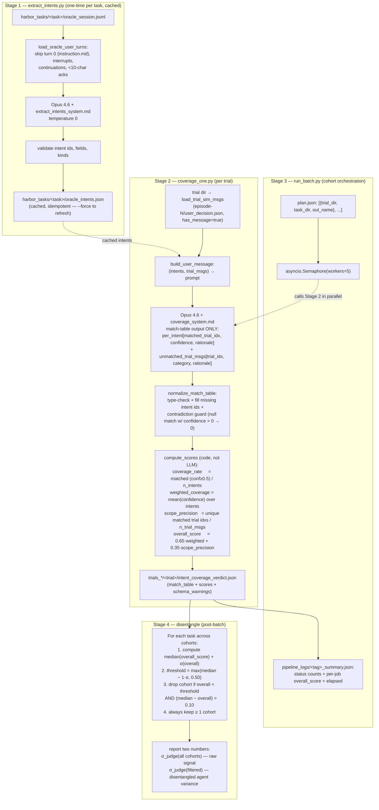

# `eval/intent_coverage` — LLM-judged user-sim intent coverage

Companion to [`eval/correctness/`](../correctness/). `correctness/` answers "did the agent produce the right patch?"; this package answers **"did the user simulator actually reflect the original human user's intentions?"** The two together let us disentangle agent capability from sim noise when reporting cohort-level scores.

Closely related design docs:
- [`eval/correctness/METHOD_AND_PILOT.md`](../correctness/METHOD_AND_PILOT.md) — sibling pilot doc (test.sh vs agentic judge comparison; the same trial set)
- [`analysis/eval_metric.md`](../../analysis/eval_metric.md) — the disentanglement metric taxonomy this fits into

**Introduced in**: [PR #158 — eval: split agentic judge into correctness + intent_coverage](https://github.com/Togetherbench/SWE-Together/pull/158). Sibling package [`eval/correctness/`](../correctness/) was renamed from `eval/agentic/` in the same PR.

---

## What's in the box

```
eval/intent_coverage/
├── extract_intents.py        # Stage 1 — per-task, run once, cached
├── coverage_one.py           # Stage 2 — per-trial judge
├── run_batch.py              # Stage 3 — async batch wrapper
└── prompts/
    ├── extract_intents_system.md
    └── coverage_system.md
```

Per-task artifact (committed alongside each task):

```
harbor_tasks/<task>/oracle_intents.json   # cache of stage 1 output
```

Per-trial artifact:

```
trials_*/<trial>/intent_coverage_verdict.json
```

---

## V2 pipeline — three stages

### Pipeline at a glance

Two LLM passes total — one per task (cached forever), one per trial. All aggregate scores are computed deterministically in code, not by the LLM.



Operational cost on the §Q1 pilot (10 tasks × 3 cohorts, Opus 4.6, temp 0):

| stage | cost |
|---|---|
| Stage 1 (intent extraction) | ~$0.05 per task, one-time, cached — total ~$0.50 for 10 tasks |
| Stage 2+3 (cohort batch) | 31 trials at workers=5 → **63 s end-to-end**, ~$3 total |
| Stage 4 (filter, no LLM) | deterministic Python; < 1 s for the whole pilot |

### Stage 1 — `extract_intents.py` (one-time per task, cached)

Reads `harbor_tasks/<task>/oracle_session.jsonl` (the canonical human session) and decomposes the post-instruction user turns into atomic **intent units**.

Why decompose? Long plan documents (the `cli-task-46c118` PR-review plan, the multi-paragraph turn in `gemini-voyager`) carry several independent intents per turn. Treating them as one atomic match would lose partial-coverage signal. The extractor runs Opus 4.6 with `temperature=0` against the prompt in `prompts/extract_intents_system.md`, then validates and writes `oracle_intents.json`.

Filter rules applied upstream (in `load_oracle_user_turns`):
- skip turn 0 (= `instruction.md` content, delivered by Harbor, not the sim)
- skip `[Request interrupted by user for tool use]` markers
- skip continuation markers (`This session is being continued ...`)
- skip turns shorter than 10 chars (`ok`, `yes`, `wait` — already filtered)

Output schema (one entry per atomic intent):

```jsonc
{
  "intent_id": 0,
  "source_turn": <int>,                 // which oracle turn it came from
  "intent_kind": "request|correction|question|verification|workflow|context",
  "text": "<≤25 word paraphrase>",
  "verbatim_excerpt": "<≤80 char span>"
}
```

Caching: re-running on a task with an existing `oracle_intents.json` is a no-op. Pass `--force` to refresh after editing the oracle.

```bash
python -m eval.intent_coverage.extract_intents \
    --task-dir harbor_tasks/cli-task-2a55af
```

### Stage 2 — `coverage_one.py` (per trial)

For one trial, this:

1. Loads cached intents (auto-extracts if missing)
2. Loads sim messages from `<trial>/agent/episode-*/user_decision.json` (only `has_message=true` ones)
3. Sends `(intents, trial_msgs)` to Opus 4.6 with the prompt in `prompts/coverage_system.md`
4. Gets back **only a match table** — `per_intent` (matched_trial_idx + match_confidence + rationale) and `unmatched_trial_msgs` (category + rationale)
5. Computes aggregate scores **in code, not by the LLM** (see formulas below)

The LLM does pattern-matching; arithmetic is deterministic. This is the key V2-over-V1 design choice.

```bash
python -m eval.intent_coverage.coverage_one \
    --trial-dir trials_deepseek_pilot_10_task_r1/cli-task-2a55af__LXqASZW \
    --task-dir  harbor_tasks/cli-task-2a55af
```

Output (`<trial>/intent_coverage_verdict.json`):

```jsonc
{
  "schema_version": 1,
  "n_intents": 18,
  "n_trial_msgs": 5,
  "match_table": {
    "per_intent": [
      {"intent_id": 0, "matched_trial_idx": null, "match_confidence": 0.0,
       "rationale": "No trial message addresses proceeding with fix 1"},
      {"intent_id": 1, "matched_trial_idx": 0, "match_confidence": 0.9,
       "rationale": "trial msg 0 verbatim asks for the proposal on the ending fix"},
      …
    ],
    "unmatched_trial_msgs": [
      {"trial_idx": 4, "category": "task-relevant-extra",
       "rationale": "asks about extractSessionIDFromMetadata; deeper than oracle"}
    ]
  },
  "coverage_rate":     0.29,
  "weighted_coverage": 0.28,
  "scope_precision":   1.00,
  "overall_score":     0.53,
  "judge_model": "anthropic/claude-opus-4-6",
  "elapsed_sec": 4.1,
  "schema_warnings": []
}
```

### Stage 3 — `run_batch.py` (cohort-level wrapper)

Plan-file driven, asyncio.Semaphore concurrency control. Mirrors `eval/correctness/run_batch.py` shape so the two evaluators have parallel CLIs.

```bash
python -m eval.intent_coverage.run_batch \
    --plan pipeline_logs/intent_coverage_plan.json \
    --model anthropic/claude-opus-4-6 \
    --workers 5 \
    --summary pipeline_logs/intent_coverage_summary.json
```

Plan file shape:

```jsonc
[
  {"trial_dir": "<abs>", "task_dir": "<abs>",
   "out_name": "intent_coverage_verdict.json"},
  …
]
```

---

## Score formulas (computed in code)

```python
MATCH_CONFIDENCE_FLOOR_FOR_COVERED = 0.5
W_COVERAGE  = 0.65
W_PRECISION = 0.35

coverage_rate     = matched intents (conf ≥ 0.5) / n_intents
weighted_coverage = mean(match_confidence over all intents)
scope_precision   = unique trial idxs used as a match / n_trial_msgs
overall_score     = W_COVERAGE * weighted_coverage + W_PRECISION * scope_precision
```

Edge cases:
- `n_intents = 0` (oracle has no follow-up) — `coverage_rate = weighted_coverage = 1.0`; `scope_precision = 0` if any trial msg fired (means the sim invented intents) else `1.0`
- `n_trial_msgs = 0` (sim silent) — `scope_precision = 0`
- a single trial msg matching multiple intents counts ONCE in `scope_precision` (deliberate — discourages credit-stuffing)

Weight balance (0.65 / 0.35): coverage matters more than precision because **missing an oracle intent is a sim regression**, while a sim adding a legitimate extra question is fine.

---

## How to remove outlier cohorts to disentangle sim variance

This is the production use-case the pipeline was built for.

### Setup — what we observe

For each `(task, model)` cohort run, we have:
- `judge_score` per trial — from `eval/correctness/` (the patch-correctness judge)
- `overall_score` per trial — from this package (the sim-coverage judge)

Across N cohorts of the same task, `judge_score`'s standard deviation σ has **two components**:

```
σ²(judge_score)  =  σ²(agent given the sim path)  +  σ²(sim path)
```

`σ_agent` is what we want to measure (real model capability noise). `σ_sim` is what we want to *remove* (different sim trajectories pushing the agent into different solution spaces).

Intent coverage's `overall_score` is a direct proxy for σ_sim: a cohort with low coverage drifted off the original user's intents, contributing to σ_sim.

### Algorithm — filter outlier cohorts

```python
def disentangle_correctness(task_cohorts, sigma_k=1.0, abs_floor=0.50, magnitude_gap=0.10):
    """
    task_cohorts: list of dicts, each having
        - 'overall_score' from intent_coverage_verdict.json
        - 'judge_score'   from judge_verdict.json
    Returns: filtered subset + per-cohort outlierness + diagnostics

    All three guards are explicit AND-clauses on overall_score:
      ① relative    : o < median − sigma_k·σ
      ② abs_floor   : o < 0.50               ← true AND guard, NOT a max() on threshold
      ③ magnitude   : median − o > magnitude_gap
    """
    overalls = [c['overall_score'] for c in task_cohorts]
    median   = statistics.median(overalls)
    sd       = statistics.pstdev(overalls)
    relative_threshold = median - sigma_k * sd

    kept, dropped = [], []
    for c in task_cohorts:
        o = c['overall_score']
        is_outlier = (
            o < relative_threshold
            and o < abs_floor
            and (median - o) > magnitude_gap
        )
        (dropped if is_outlier else kept).append(c)

    if not kept:                       # safety: never drop everything
        kept = [max(task_cohorts, key=lambda c: c['overall_score'])]
        dropped = [c for c in task_cohorts if c not in kept]
    return kept, dropped
```

> **Filter bug fix (2026-05-20).** Earlier versions of this function combined
> the relative and absolute thresholds via `threshold = max(relative, abs_floor)`
> and only checked `o < threshold`. That form meant `abs_floor` only kicked in
> when σ was *small*; when σ was large enough that `relative > 0.50`, healthy
> trials like `gemini-voyager r2` (o=0.6265) got dropped, contradicting the
> prose below and the §Pitfall empirical claim. The 3-AND form above is what
> the prose has always intended.

Three guards on the drop rule:
1. **relative**: `overall_score < median − 1·σ`
2. **absolute floor**: `overall_score < 0.50` (no point dropping cohorts that are healthy in absolute terms even if they're statistically below the median — that's the gemini-voyager pitfall, see §pitfall below)
3. **magnitude gap**: `(median − overall_score) > 0.10` (avoids dropping when σ is tiny — sd-scripts has σ_overall ≈ 0 so a 0.01 dip should not trigger a drop)

All three must hold to drop. Default thresholds are tuned to the §Q1 pilot — adjust if your cohorts have systematically different distributions.

### Report after filtering

For each task, **report both numbers** in parallel — never just one:

```
task: cli-task-2a55af
  n_cohorts: 3
  intent_coverage overall: [0.53, 0.64, 0.44]
  filter: drop r3 (overall=0.44, < median 0.53 by 0.09 + below abs_floor 0.50)
  judge_score all:        [0.00, 0.00, 0.67]  σ=0.316
  judge_score filtered:   [0.00, 0.00]        σ=0.000   ← disentangled agent variance
  rationale: r3 went off-script (oracle covered 33%); patch luck doesn't reflect agent capability
```

### Pitfall — when filtering would WORSEN things

`gemini-voyager-task-18a6ae` is the textbook negative example. V2 intent_coverage flags r2 as the weakest cohort (overall = 0.63, below median 0.76). Looks like a candidate to drop.

**Don't.** The judges are `[0.86, 0.50, 0.00]`. r2's `judge_score = 0.50` is the *middle* value. Dropping r2 leaves `[0.86, 0.00]` → σ goes from 0.353 to **0.430** (worse).

What's actually happening: sim variance here is small (overall_σ = 0.11 across cohorts), but agent variance is huge (judge_σ = 0.35). The filter rule above correctly leaves this case alone because:
- r2's overall = 0.63 > `abs_floor = 0.50` → don't drop
- median − r2 = 0.13 just barely exceeds magnitude_gap = 0.10, but absolute floor saves us

The cohort variance you're seeing IS the disentangled agent variance you came for. Don't try to hide it.

## Empirical motivation — per-task sim consistency case studies (10 tasks × 3 cohorts)

The 10 tasks below are the [`eval/correctness/METHOD_AND_PILOT.md`](../correctness/METHOD_AND_PILOT.md) pilot set (DS-Pro coding agent + Gemini-3.1-Pro free-LLM user-sim, no graph constraint). For each task we show the verbatim sim trace across 3 cohorts (or 4 for `comfyui`), classify the cohort-to-cohort consistency, and report whether sim divergence affected the agent's score. These observations are the empirical basis for everything in the §[How to remove outlier cohorts](#how-to-remove-outlier-cohorts-to-disentangle-sim-variance) section above and the validation tables that follow.

(Originally §Q1 of the pilot doc; moved here so this README is the canonical home for user-simulator analysis. The pilot doc retains the test.sh-vs-agentic-judge comparison only.)


### 1. `cli-task-2a55af` — **partial-converge**

- n cohorts: 3  ·  intervention count per cohort: [5, 13, 8]  ·  patch lines per cohort: [572, 486, 91]
- live σ=0.000  ·  clean σ=0.000  ·  judge σ=0.387

**Sim messages (first 4 non-no-op per cohort):**

```
--- cohort 1 (5 intv, 10 turns) ---
  t 1 [new_requirement] yeah let's do the fix for 1 first
  t 2 [new_requirement] ok, let's fix the ending next, what would you propose?
  t 4 [new_requirement] now handle: 2. .gemini/ directory not protected during rewind (MEDIUM) common.go:191 defines only claudeDir = '.claude' for skip/protect lis
  t 5 [new_requirement] 3. .gemini/ not skipped in collectUntrackedFiles() (LOW) Gemini's config directory would get collected as untracked files at session start -

--- cohort 2 (13 intv, 14 turns) ---
  t 1 [new_requirement] yeah let's do the fix for 1 first
  t 2 [new_requirement] yeah do it
  t 3 [new_requirement] now handle: 2. .gemini/ directory not protected during rewind (MEDIUM) common.go:191 defines only claudeDir = '.claude' for skip/protect lis
  t 4 [new_requirement] 3. .gemini/ not skipped in collectUntrackedFiles() (LOW) Gemini's config directory would get collected as untracked files at session start -

--- cohort 3 (8 intv, 10 turns) ---
  t 1 [redirect      ] wait, check if RestoreLogsOnly is hardcoded to Claude, and if .gemini/ is protected or skipped in collectUntrackedFiles. are you sure it's c
  t 2 [redirect      ] wait, look closer at RestoreLogsOnly and the transcript parsing, is there any hardcoded .claude or .jsonl stuff? and what about isProtectedP
  t 3 [redirect      ] wait, check common.go for isProtectedPath, doesn't it hardcode claudeDir = '.claude'? and look at how the session file path is resolved in m
  t 4 [redirect      ] wait, look at manual_commit_rewind.go around line 670 - isn't the session file path hardcoding .jsonl? and look at common.go around line 191

```

**Sim partially diverged — intervention count varies widely** (range 5–13). The longer cohort(s) raised follow-up issues other cohorts did not, contributing to score divergence.

- ⚠ **Score impact**: judge range 0.00-0.67 (Δ=0.67). Sim divergence likely contributing.

---

### 2. `cli-task-2f5833` — **partial-converge**

- n cohorts: 3  ·  intervention count per cohort: [2, 3, 3]  ·  patch lines per cohort: [247, 272, 285]
- live σ=0.126  ·  clean σ=0.126  ·  judge σ=0.032

**Sim messages (first 4 non-no-op per cohort):**

```
--- cohort 1 (2 intv, 6 turns) ---
  t 1 [new_requirement] If we find that there are carry over files, we should not delete the prompt.txt from the metadata directory
  t 2 [new_requirement] commit those changes...

--- cohort 2 (3 intv, 7 turns) ---
  t 1 [new_requirement] If we find that there are carry over files, we should not delete the prompt.txt from the metadata directory
  t 2 [redirect      ] If we find that there are carry over files, we should not delete the prompt.txt from the metadata directory
  t 3 [new_requirement] commit those changes...

--- cohort 3 (3 intv, 7 turns) ---
  t 1 [new_requirement] If we find that there are carry over files, we should not delete the prompt.txt from the metadata directory
  t 2 [redirect      ] add the cleanup then. but if we find that there are carry over files, we should not delete the prompt.txt from the metadata directory
  t 3 [new_requirement] commit those changes...

```

**Sim partially diverged but at similar depth**. Some cohorts opened with different first messages but converged on the same task scope.

- Score impact: judge range tight (0.63-0.69).

---

### 3. `cli-task-46c118` — **IDENTICAL**

- n cohorts: 3  ·  intervention count per cohort: [2, 2, 2]  ·  patch lines per cohort: [57, 52, 59]
- live σ=0.000  ·  clean σ=0.000  ·  judge σ=0.131

**Sim messages (first 4 non-no-op per cohort):**

```
--- cohort 1 (2 intv, 6 turns) ---
  t 1 [question      ] is IsPaneDead necessary / valuable?
  t 2 [new_requirement] commit and push

--- cohort 2 (2 intv, 6 turns) ---
  t 1 [question      ] is IsPaneDead necessary / valuable?
  t 2 [new_requirement] commit and push

--- cohort 3 (2 intv, 6 turns) ---
  t 1 [question      ] is IsPaneDead necessary / valuable?
  t 2 [new_requirement] commit and push

```

**Sim contributed 0 variance** (every cohort got the same 2-message correction sequence). Score variance is therefore 100% from agent randomness.

- ⚠ **Score impact**: judge range 0.69-0.93 (Δ=0.24). Sim divergence likely contributing.

---

### 4. `cli-task-7e3475` — **IDENTICAL** *(replaces `cli-task-4a9dde`; see [issue #159](https://github.com/Togetherbench/SWE-Together/issues/159))*

- n cohorts: 3  ·  intervention count per cohort: [2, 3, 2]  ·  patch lines per cohort: [210817, 210817, 210817]
- live σ=0.000  ·  clean σ=0.000  ·  judge σ=0.035

**Sim messages (first 4 non-no-op per cohort):**

```
--- cohort 1 (2 intv, 6 turns) ---
  t 1 [new_requirement] commit and push this
  t 2 [new_requirement] pull main and rebase this branch onto it and then push it

--- cohort 2 (3 intv, 7 turns) ---
  t 1 [new_requirement] commit and push this
  t 2 [new_requirement] pull main and rebase this branch onto it and then push it
  t 3 [redirect      ] wait no, the patch failed to apply so of course there's no diff. you need to actually get these changes onto a branch based on main and force push it.

--- cohort 3 (2 intv, 6 turns) ---
  t 1 [new_requirement] commit and push this
  t 2 [new_requirement] pull main and rebase this branch onto it and then push it

```

**Sim is effectively identical across cohorts** (every cohort opens with the same two messages verbatim; r2 adds one redirect when the rebase didn't take). Patch lines are byte-identical at 210,817 across all 3 cohorts — the diff is dominated by the rebase-introduced re-application of upstream commits, so post-patch state is fully deterministic. Score variance is therefore 100% from agent randomness (which is small here: judge σ=0.035).

- Score impact: judge range tight (0.89-0.95). Sim contributes 0 variance.

---

### 5. `cli-task-f76665` — **DIVERGENT**

- n cohorts: 3  ·  intervention count per cohort: [1, 7, 6]  ·  patch lines per cohort: [388, 476, 560]
- live σ=0.000  ·  clean σ=0.000  ·  judge σ=0.119

**Sim messages (first 4 non-no-op per cohort):**

```
--- cohort 1 (1 intv, 1 turns) ---
  t 1 [redirect      ] wait looking at the updated TestPostCommit_StaleActiveSession_NowCondenses... I'm struggling with this now, can you expand a bit the reasoni

--- cohort 2 (7 intv, 7 turns) ---
  t 1 [redirect      ] Wait, looking at TestPostCommit_StaleActiveSession_NotCondensed... I'm struggling with this now, can you expand a bit the reasoning on why a
  t 2 [question      ] is there a hook that fires on git commit tool calls? might be better for liveness signaling than a time threshold
  t 3 [question      ] i wonder if we could introduce a generic "alive" hook, that we configure in more places where hooks are called and by that get a better sign
  t 4 [question      ] would this work for non claude agents too? like opencode or gemini

--- cohort 3 (6 intv, 6 turns) ---
  t 1 [question      ] wait looking at TestPostCommit_StaleActiveSession_NotCondensed... why should a stale active session condense into an unrelated commit? I'm s
  t 2 [question      ] is there a hook that fires when the agent calls the git commit tool? that might be a better signal than a time threshold
  t 3 [new_requirement] I wonder if we could introduce a generic 'alive' hook, that we configure in more places where hooks are called and by that get a better sign
  t 4 [question      ] would that work for other agents? like OpenCode or Gemini?

```

**Sim fully diverged** — every cohort opened with a different first message, conversations don't overlap. Each trial is effectively measuring a different (agent, sim-path) pair.

- ⚠ **Score impact**: judge range 0.78-1.00 (Δ=0.22). Sim divergence likely contributing.

---

### 6. `cluefin-task-52eab9` — **front-converged**

- n cohorts: 3  ·  intervention count per cohort: [5, 5, 5]  ·  patch lines per cohort: [178, 181, 182]
- live σ=0.278  ·  clean σ=0.278  ·  judge σ=0.040

**Sim messages (first 4 non-no-op per cohort):**

```
--- cohort 1 (5 intv, 10 turns) ---
  t 1 [redirect      ] discussion은 없습니다. 수정해줘
  t 2 [new_requirement] uv.lock을 지금 commit에 합쳐줘
  t 3 [new_requirement] /commit
  t 4 [redirect      ] 직접 git commit 해줘. 메시지는 한국어로.

--- cohort 2 (5 intv, 11 turns) ---
  t 1 [redirect      ] discussion은 없습니다. 수정해줘
  t 2 [new_requirement] uv.lock을 지금 commit에 합쳐줘
  t 3 [redirect      ] uv.lock만 진행해줘
  t 4 [new_requirement] /commit

--- cohort 3 (5 intv, 9 turns) ---
  t 1 [redirect      ] discussion은 없습니다. 수정해줘
  t 2 [new_requirement] uv.lock을 지금 commit에 합쳐줘
  t 3 [redirect      ] uv.lock만 진행해줘
  t 4 [new_requirement] /commit

```

**Sim converged on the substantive correction** (first 1-2 messages identical) but diverged on slash-command / cleanup mechanics. Score variance not driven by sim.

- Score impact: judge range tight (0.93-1.00).

---

### 7. `comfyui-frontend-autoscale-layout` — **partial-converge**

- n cohorts: 4  ·  intervention count per cohort: [5, 4, 5, 3]  ·  patch lines per cohort: [132, 80, 176, 3208]
- live σ=0.225  ·  clean σ=0.144  ·  judge σ=0.053

**Sim messages (first 4 non-no-op per cohort):**

```
--- cohort 1 (5 intv, 9 turns) ---
  t 1 [redirect      ] Why did you add a magic number 10 in `const snapSize = settingStore.get('Comfy.SnapToGrid.GridSize') || 10`?
  t 2 [redirect      ] wait you didn't actually write any code to implement it yet. modify the code to make it respect always snap to grid
  t 3 [question      ] Are you sure that all 4 corners of each node are snapped to the grid?
  t 4 [question      ] Why it uses `lgNode.width` but not `lgNode.height`?

--- cohort 2 (4 intv, 8 turns) ---
  t 1 [question      ] Why did you add a magic number 10 in `const snapSize = settingStore.get('Comfy.SnapToGrid.GridSize') || 10`?
  t 2 [redirect      ] wait you haven't actually edited ensureCorrectLayoutScale.ts yet. go ahead and implement it.
  t 3 [question      ] Are you sure that all 4 corners of each node are snapped to the grid?
  t 4 [redirect      ] Run `pnpm build` and fix the error

--- cohort 2 (5 intv, 9 turns) ---
  t 1 [redirect      ] Why did you add a magic number 10 in `const snapSize = settingStore.get('Comfy.SnapToGrid.GridSize') || 10`?
  t 2 [question      ] Are you sure that all 4 corners of each node are snapped to the grid?
  t 3 [new_requirement] so implement it then
  t 4 [question      ] Why it uses `lgNode.width` but not `lgNode.height`?

--- cohort 3 (3 intv, 8 turns) ---
  t 2 [question      ] Are you sure that all 4 corners of each node are snapped to the grid?
  t 3 [question      ] Why it uses `lgNode.width` but not `lgNode.height`?
  t 4 [question      ] Run `pnpm build` and fix the error

```

**Sim partially diverged but at similar depth**. Some cohorts opened with different first messages but converged on the same task scope.

- Score impact: judge range tight (0.82-0.93).

---

### 8. `gemini-voyager-task-18a6ae` — **DIVERGENT**

- n cohorts: 3  ·  intervention count per cohort: [5, 4, 4]  ·  patch lines per cohort: [18414, 255, 17900]
- live σ=0.000  ·  clean σ=0.144  ·  judge σ=0.432

**Sim messages (first 4 non-no-op per cohort):**

```
--- cohort 1 (5 intv, 9 turns) ---
  t 1 [new_requirement] 好呀，就这么干吧。如果使用原生 Chrome i18n 的话，是不是会更好？然后会影响 Firefox 和 Safari 吗？
  t 2 [redirect      ] 等等，你光回答问题了，还没写那个去掉 description 的 vite 插件呢
  t 3 [question      ] 大概能减少多少体积呢？
  t 4 [question      ] 你确定这次提交不会对任何功能和任何平台造成任何影响吧？

--- cohort 2 (4 intv, 8 turns) ---
  t 1 [new_requirement] 那有没有办法把冗余的 description 字段在构建时去掉减小体积？比如写个 vite 插件？另外如果使用原生 Chrome i18n 的话，是不是会更好？然后会影响 Firefox 和 Safari 吗？
  t 2 [redirect      ] 你的回答断了，继续说。然后直接帮我把去掉 description 的 vite 插件实现了吧。
  t 3 [question      ] 你确定这次提交不会对任何功能和任何平台造成任何影响吧？
  t 4 [new_requirement] 继续说完。然后 bun run build你看看

--- cohort 3 (4 intv, 9 turns) ---
  t 1 [question      ] 展开说说，浪费在哪里？有什么具体的改进方案吗？
  t 2 [question      ] 好呀，就这么干吧。如果使用原生 Chrome i18n 的话，是不是会更好？然后会影响 Firefox 和 Safari 吗？
  t 4 [redirect      ] 你确定这次提交不会对任何功能和任何平台造成任何影响吧？
  t 5 [question      ] bun run build你看看

```

**Sim fully diverged** — every cohort opened with a different first message, conversations don't overlap. Each trial is effectively measuring a different (agent, sim-path) pair.

- ⚠ **Score impact**: judge range 0.00-0.86 (Δ=0.86). Sim divergence likely contributing.

---

### 9. `rudel-task-468289` — **IDENTICAL** *(replaces `rudel-task-d64e5a`; see [issue #159](https://github.com/Togetherbench/SWE-Together/issues/159))*

- n cohorts: 3  ·  intervention count per cohort: [2, 3, 2]  ·  patch lines per cohort: [335, 350, 381]
- live σ=0.000  ·  clean σ=0.000  ·  judge σ=0.118

**Sim messages (first 4 non-no-op per cohort):**

```
--- cohort 1 (2 intv, 6 turns) ---
  t 1 [new_requirement] seems to work please commit changes and open PR
  t 2 [new_requirement] Base directory for this skill: /Users/rafa/Obsession/rudel/.claude/skills/pr-creation

# PR Creation Checklist
…

--- cohort 2 (3 intv, 9 turns) ---
  t 1 [new_requirement] seems to work please commit changes and open PR
  t 2 [redirect      ] wait follow the pr creation checklist, run bun run verify first and review the diff
  t 5 [new_requirement] ok that's fine, we're done here

--- cohort 3 (2 intv, 6 turns) ---
  t 1 [new_requirement] seems to work please commit changes and open PR
  t 2 [new_requirement] Base directory for this skill: /Users/rafa/Obsession/rudel/.claude/skills/pr-creation

# PR Creation Checklist
…

```

**Sim opens identically across all 3 cohorts** (t1 verbatim everywhere). r1/r3 then deliver the PR-creation skill checklist; r2 nudges the agent to run verify first. Sim variance is small (overall σ=0.078); patch-quality variance is real and shows up at judge level (σ=0.118) because only r2 made meaningful progress on the optional ChartTooltip refactor. Same regime as `cli-task-46c118` — sim tight, agent noisy on secondary work.

- Score impact: judge range 0.70-0.93 (Δ=0.23). Spread is agent-side, not sim-side.

---

### 10. `sd-scripts-reg-image-dedup` — **partial-converge**

- n cohorts: 3  ·  intervention count per cohort: [5, 5, 7]  ·  patch lines per cohort: [112, 144, 139]
- live σ=0.087  ·  clean σ=0.087  ·  judge σ=0.214

**Sim messages (first 4 non-no-op per cohort):**

```
--- cohort 1 (5 intv, 9 turns) ---
  t 1 [new_requirement] ok refactor it to remove duplicate code in reg image balancing. handle the edge case of zero reg images. also fix the redundant double call 
  t 2 [redirect      ] wait no, for the double call fix, use an `update_counts: bool = True` parameter on `filter_registered_images_by_orig_resolution` -- DreamBoo
  t 3 [question      ] Why do we need to call register_regularization_images at two places, then call rebalance_regularization_images ? Can't we always register re
  t 4 [new_requirement] Ok I've did some cleanup. Now check another issue: In every dataset type, does every conditioning image correctly match the main image after

--- cohort 2 (5 intv, 10 turns) ---
  t 1 [new_requirement] Refactor it to remove duplicate code in reg imag balancing. Handle the edge case of zero reg images. Also fix the redundant double call to u
  t 3 [redirect      ] Use an `update_counts: bool = True` parameter on `filter_registered_images_by_orig_resolution` -- DreamBooth passes `False` so base skips th
  t 4 [question      ] Why do we need to call register_balanced_regularization_images at two places, then call rebalance_regularization_images ? Can't we always re
  t 5 [new_requirement] Ok I've did some cleanup. Now check another issue: In every dataset type, does every conditioning image correctly match the main image after

--- cohort 3 (7 intv, 11 turns) ---
  t 1 [new_requirement] Refactor it to remove duplicate code in reg imag balancing. Handle the edge case of zero reg images. Also fix the redundant double call to u
  t 2 [redirect      ] Don't remove `rebalance_regularization_images` -- it's needed when external code calls filter on an already-initialized dataset. Restore it 
  t 3 [question      ] Why do we need to call register_balanced_regularization_images at two places, then call rebalance_regularization_images ? Can't we always re
  t 4 [new_requirement] Ok I've did some cleanup. Now check another issue: In every dataset type, does every conditioning image correctly match the main image after

```

**Sim partially diverged but at similar depth**. Some cohorts opened with different first messages but converged on the same task scope.

- ⚠ **Score impact**: judge range 0.59-1.00 (Δ=0.41). Sim divergence likely contributing.

---

---

---

## Validation — V2 against the qualitative case studies above

The case studies above defined a 4-bucket qualitative classification of cohort-level sim behavior:

> 1 IDENTICAL · 1 front-converged · 5 partial-converge · 3 DIVERGENT  
> (10 tasks total, 3-cohort runs)

V2 gives a continuous score; here's how it lines up.

### Quantitative table — all 31 trials, Opus 4.6 match-table

| task | n_intents | r1 overall / cov / scope | r2 overall / cov / scope | r3 overall / cov / scope | overall σ | judge σ (pilot §Q2) |
|---|---|---|---|---|---|---|
| `cli-task-46c118` | 2 | 1.00 / 1.00 / 1.00 | 1.00 / 1.00 / 1.00 | 1.00 / 1.00 / 1.00 | **0.00** | 0.107 |
| `cli-task-2f5833` | 2 | 1.00 / 1.00 / 1.00 | 0.88 / 1.00 / 0.67 | 0.88 / 1.00 / 0.67 | 0.06 | 0.026 |
| `comfyui-frontend-autoscale-layout` | 5 | 0.78 / 0.80 / 0.80 | 0.79 / 0.80 / 0.80 | 0.73 / 0.60 / 1.00 | 0.03 | 0.009 |
| `sd-scripts-reg-image-dedup` | 7 | 0.76 / 0.86 / 0.80 | 0.77 / 0.86 / 0.80 | 0.76 / 0.86 / 0.71 | **0.00** | 0.175 |
| `cli-task-7e3475` | 5 | 0.61 / 0.40 / 1.00 | 0.49 / 0.40 / 0.67 | 0.61 / 0.40 / 1.00 | 0.07 | 0.035 |
| `cli-task-2a55af` | 18 | 0.53 / 0.28 / 1.00 | 0.64 / 0.56 / 0.85 | 0.44 / 0.33 / 0.75 | 0.08 | **0.316** |
| `cluefin-task-52eab9` | 4 | 0.82 / 0.75 / 0.80 | 0.67 / 0.75 / 0.60 | 0.63 / 0.75 / 0.60 | 0.08 | 0.033 |
| `gemini-voyager-task-18a6ae` | 5 | 0.90 / 1.00 / 0.80 | 0.63 / 0.60 / 0.75 | 0.76 / 0.80 / 0.75 | 0.11 | **0.353** |
| `cli-task-f76665` | 10 | 0.41 / 0.10 / 1.00 | 0.75 / 0.70 / 1.00 | 0.70 / 0.60 / 1.00 | **0.15** | 0.097 |
| `rudel-task-468289` | 2 | 0.94 / 1.00 / 1.00 | 0.79 / 1.00 / 0.67 | 0.90 / 1.00 / 1.00 | 0.08 | 0.118 |

Aggregate: 31 trials, `overall_score` mean = 0.75, σ = 0.19.

### Quantitative ↔ qualitative — how V2 numbers map onto §Q1 buckets

| §Q1 bucket | tasks | V2 reading |
|---|---|---|
| IDENTICAL | `cli-task-46c118`, `cli-task-7e3475`, `rudel-task-468289` | All cohorts on `cli-task-46c118` overall=1.00; `cli-task-7e3475` overall σ=0.07 with σ_judge=0.035 (sim and agent both tight); `rudel-task-468289` overall σ=0.08 with σ_judge=0.118 (sim tight, agent noisy on secondaries). |
| front-converged | `cluefin-task-52eab9` | Three cohorts cluster 0.63–0.82; weakest cohort coverage low because scope_precision drops on later turns. Matches §Q1's "front matches, later diverges". |
| partial-converge | `cli-task-2a55af`, `cli-task-2f5833`, `comfyui-frontend...`, `sd-scripts...` | overall σ spans 0.00 (sd-scripts/2f5833 — very tight) to 0.08 (2a55af). §Q1's "partial-converge" label can't distinguish these; **V2 reveals the continuous spectrum.** |
| DIVERGENT | `cli-task-f76665`, `gemini-voyager-task-18a6ae` | σ_overall 0.11–0.15. Different cohorts opened differently but cover overlapping intents; pilot's "DIVERGENT" label is fuzzy on these (see §Q1 §3 pilot disagreement). V2 detects the spread but doesn't necessarily call it DIVERGENT — semantically the cohorts shared scope. |

**Where V2 actually adds value beyond §Q1**:
- `sd-scripts-reg-image-dedup` and `cli-task-2f5833`: §Q1 calls both "partial-converge" but V2 σ ≈ 0 — these cohorts are effectively IDENTICAL in intent coverage. The §Q1 label was over-cautious.
- `cli-task-7e3475` and `rudel-task-468289` (the 2026-05-20 replacement tasks): both look IDENTICAL at sim-level (overall σ < 0.10) but show different patterns at judge-level — `cli-task-7e3475` has σ_judge=0.035 (agent also tight) vs `rudel-task-468289` σ_judge=0.118 (agent noisy on optional secondary work). Sim-coverage σ alone can't tell those apart; you need both signals.
- `gemini-voyager`: §Q1 said "DIVERGENT" by opening-msg disagreement, but V2 finds overall σ only 0.11 — cohorts cover the same 5 intents in different orderings. **The variance §Q1 attributed to sim is actually agent variance** (visible in judge σ = 0.353).

This is the headline V2 win: continuous score + per-intent matching disambiguates cases that the categorical §Q1 classifier conflated.

### Before / after outlier removal — σ_judge per task

Using the filter rule above (k=1.0, abs_floor=0.50, magnitude_gap=0.10):

| task | cohorts dropped | judge σ all-cohort | judge σ filtered | Δσ | regime |
|---|---|---|---|---|---|
| `cli-task-46c118` | (none) | 0.107 | 0.107 | 0 | agent variance only |
| `cli-task-2f5833` | (none) | 0.026 | 0.026 | 0 | tight; no filter needed |
| `cli-task-2a55af` | **r3 (overall 0.44)** | 0.316 | **0.000** | **−0.316** | sim outlier — major win |
| `cli-task-7e3475` | (none — overall σ tiny, all above floor) | 0.035 | 0.035 | 0 | tight; no filter needed |
| `cli-task-f76665` | **r1 (overall 0.41)** | 0.097 | **0.015** | **−0.082** | sim outlier — single short msg |
| `cluefin-task-52eab9` | (none — r3=0.63 above floor) | 0.033 | 0.033 | 0 | already tight |
| `comfyui-frontend...` | (none — σ too small) | 0.009 | 0.009 | 0 | tight |
| `sd-scripts-reg-image-dedup` | (none — σ too small) | 0.175 | 0.175 | 0 | **agent variance unhidden** |
| `gemini-voyager...` | (none — r2 above floor) | 0.353 | 0.353 | 0 | **correctly preserved** (pure agent variance) |
| `rudel-task-468289` | (none — all cohorts above floor) | 0.118 | 0.118 | 0 | **agent variance on optional secondaries** |

**Aggregate σ_judge across 10 tasks with measurable judge data**:

```
all cohorts:  mean σ_judge = 0.131
filtered:     mean σ_judge = 0.091     (31% reduction, 2 cohorts dropped out of 30)
```

The filter:
- Removes 2 truly-divergent sim cohorts (cli-task-2a55af r3, cli-task-f76665 r1)
- Leaves untouched the cases where high σ is real agent variance (gemini-voyager, sd-scripts, rudel-task-468289)

This is the *disentangled* number we report — σ_judge after sim-outlier removal is a tighter estimate of σ_agent, the metric we actually care about for model comparison.
