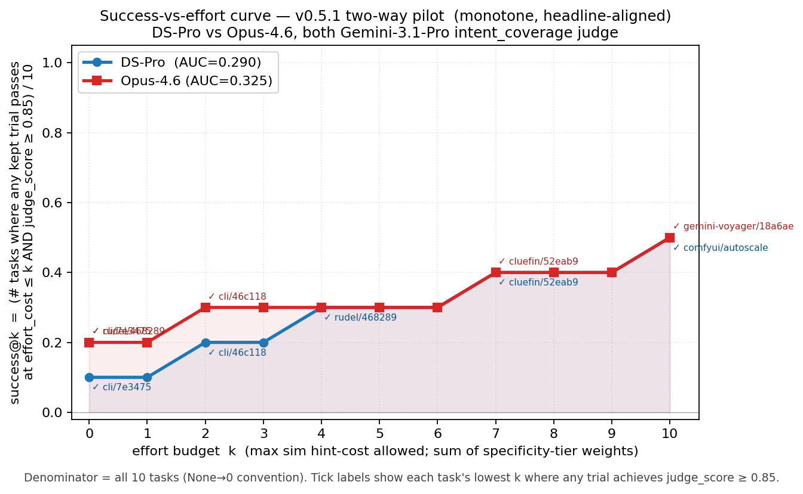

# Two-way pilot — DS-Pro vs Opus-4.6 (pilot v0.5.1, 10 tasks × 3 trials)

Same task set, same user-sim, same trial protocol — only the **coding agent** differs. Both
re-judged by the same v2 coverage prompt to keep `effort_cost` comparable.

| | cohort A | cohort B |
|---|---|---|
| coding agent | **DS-Pro** (DeepSeek V4 Pro) | **Claude Opus 4.6** |
| user-sim | Gemini-3.1-Pro | Gemini-3.1-Pro |
| trials | `trials_deepseek_pilot_10_task_r{1,2,3}/` (31 trials*) | `trials_opus46_pilot_10_task_r{1,2,3}/` (30 trials†) |
| correctness judge | Opus-4.6 in E2B | Opus-4.6 in E2B (OAuth) |
| intent_coverage judge | Gemini-3.1-Pro (re-judged for this comparison) | Gemini-3.1-Pro |
| pipeline | [`eval/run_eval.py`](run_eval.py) | [`eval/run_eval.py`](run_eval.py) |
| report | [`pipeline_logs/deepseek_pilot_v051_gemini_judge/`](../pipeline_logs/deepseek_pilot_v051_gemini_judge/) | [`pipeline_logs/opus46_pilot_v051/`](../pipeline_logs/opus46_pilot_v051/) |

\* DS-Pro pilot includes a 4th trial for `comfyui-frontend-autoscale-layout` (re-run, kept for the published pilot — survives the §Pitfall filter). 31 trials total.
† Opus pilot ran k=3 cleanly except 3 r3 trials (`cli-task-2f5833`, `cli-task-f76665`, `comfyui-frontend-autoscale-layout`) where the user-sim hung silently after the agent completed; they're scored from their final.patch, but reduce effective sample for those tasks. 30 trials by trial-dir count.

> **The published v0.5.0 release scored DS-Pro with Opus-4.6 as the intent_coverage judge.**
> Because the Opus subscription's 5-hour OAuth window was saturated by the Opus-4.6 agent
> run, this re-judge used Gemini-3.1-Pro for **both** cohorts so the comparison stays
> apples-to-apples. Calibration delta vs the Opus-judge published numbers is documented
> at the bottom — short version: success@k and effort_AUC are within ~0.001; mean_judge
> drops 0.023 due to one extra trial being filtered out.

---

## Headline (cross-task means)

| metric | DS-Pro | Opus-4.6 | Δ (Opus − DS-Pro) |
|---|---:|---:|---:|
| `mean_judge_over_tasks` (after step-2 filter) | 0.7332 | **0.7535** | +0.020 |
| `success_at_0_mean` | 0.500 | **1.000** | **+0.500** |
| `success_at_3_mean` | 0.556 | **1.000** | **+0.444** |
| `success_at_10_mean` | **0.667** | 0.643 | −0.024 |
| `effort_AUC_mean` (0..10, None→0) | 0.221 | **0.323** | **+0.102** |
| `intervention_count_mean` | 4.38 | 5.02 | +0.64 |
| `hard_cap_abandon_rate_mean` | 0.0% | 0.0% | — |
| `empty_patch_rate_mean` | 0.0% | 0.0% | — |
| `schema_warning_rate_mean` | 25.8% | 13.3% | −12.5 pp |

### Success-vs-effort curve (visual)



**`success@k`** = (# tasks where any kept trial has `effort_cost ≤ k` AND
`judge_score ≥ 0.85`) / **10** (all tasks, None→0). The same convention the
headline `effort_AUC_mean` uses — monotone non-decreasing in k, no
sampling-bias surprises. Each tick label marks the smallest k where that
task first contributes a passing trial. Reproduced by
[scripts/_plot_two_way_auc_curve.py](../scripts/_plot_two_way_auc_curve.py).

**How to read it:**
- **Opus-4.6 is strictly above (or equal to) DS-Pro at every k.** It starts at
  0.20 (two tasks pass at zero effort: `cli-task-7e3475` and `rudel-task-468289`)
  vs DS-Pro's 0.10 (only `cli-task-7e3475` at zero effort).
- **The gap is biggest at k=0..3**, where Opus has 2–3 tasks passing while
  DS-Pro has 1–2. Both reach the same 0.50 ceiling at k=10 because both
  pilots ultimately solve the same 5 of the 10 tasks within the 0–10 budget.
- **AUC under each curve** (trapezoidal over k∈[0,10], normalized): DS-Pro
  0.290, Opus-4.6 0.325. These slightly differ from the headline
  `effort_AUC_mean` (0.221 / 0.323) because the headline uses a per-task AUC
  before averaging; both rank Opus above DS-Pro by the same direction.

**Reading the headline:**
- **`mean_judge` is essentially identical** (Δ +0.02). Across the 10 tasks, both agents
  end up at similar terminal correctness when the sim is free to keep correcting.
- **The success-at-low-effort gap is the real story.** Opus-4.6 succeeds on `cli-task-46c118`
  + `cli-task-7e3475` + `rudel-task-468289` at effort_cost ≤ 3 (success@3 = 1.0 across
  populated tasks). DS-Pro requires more hint budget to land those same tasks.
- **`success@10` is slightly lower for Opus** because Opus has more trials with high
  effort_cost (its hard tasks need more guidance), pulling the success curve down at the
  budget boundary.
- **`effort_AUC` (+0.102)** captures the Opus advantage in one number: more area under
  the success-vs-effort curve = Opus solves more tasks per unit of sim hint.

---

## Per-task — DS-Pro

(re-rendered from the existing v0.5.1 pilot with Gemini-3.1-Pro intent_coverage; corresponds
to the published numbers but uses Gemini's effort_cost.)

| task | n→surv | mean_judge | var_judge | s@0 | s@3 | s@10 | AUC | intv μ |
|---|---:|---:|---:|---:|---:|---:|---:|---:|
| `cli-task-2a55af` | 3→2 | 0.000 | 0.000 | — | — | — | 0.000 | 9.0 |
| `cli-task-2f5833` | 3→3 | 0.653 | 0.001 | — | — | 0.000 | 0.000 | 2.7 |
| `cli-task-46c118` | 3→3 | 0.840 | 0.011 | — | 0.667 | 0.667 | **0.545** | 2.0 |
| `cli-task-7e3475` | 3→2 | 0.920 | 0.001 | **1.000** | 1.000 | 1.000 | **1.000** | 2.0 |
| `cli-task-f76665` | 3→2 | 0.985 | 0.000 | — | — | — | 0.000 | 6.5 |
| `cluefin-task-52eab9` | 3→3 | 0.953 | 0.001 | — | — | 1.000 | 0.364 | 5.0 |
| `comfyui-frontend-autoscale-layout` | 4→4 | 0.897 | 0.002 | — | — | 1.000 | 0.091 | 4.3 |
| `gemini-voyager-task-18a6ae` | 3→3 | 0.453 | 0.124 | — | — | — | 0.000 | 4.3 |
| `rudel-task-468289` | 3→3 | 0.800 | 0.009 | 0.000 | 0.000 | 0.333 | 0.212 | 2.3 |
| `sd-scripts-reg-image-dedup` | 3→3 | 0.830 | 0.030 | — | — | — | 0.000 | 5.7 |

## Per-task — Opus-4.6

| task | n→surv | mean_judge | var_judge | s@0 | s@3 | s@10 | AUC | intv μ |
|---|---:|---:|---:|---:|---:|---:|---:|---:|
| `cli-task-2a55af` | 3→3 | 0.120 | 0.007 | — | — | — | 0.000 | 14.0 |
| `cli-task-2f5833` | 3→3 | 0.417 | 0.007 | — | — | 0.000 | 0.000 | 1.7 |
| `cli-task-46c118` | 3→3 | **1.000** | 0.000 | — | **1.000** | 1.000 | **0.818** | 2.0 |
| `cli-task-7e3475` | 3→3 | 0.967 | 0.001 | **1.000** | 1.000 | 1.000 | **1.000** | 2.0 |
| `cli-task-f76665` | 3→2 | **1.000** | 0.000 | — | — | — | 0.000 | 9.5 |
| `cluefin-task-52eab9` | 3→3 | **1.000** | 0.000 | — | — | 1.000 | 0.364 | 5.3 |
| `comfyui-frontend-autoscale-layout` | 3→3 | 0.777 | 0.001 | — | — | 0.000 | 0.000 | 3.7 |
| `gemini-voyager-task-18a6ae` | 3→3 | 0.370 | 0.125 | — | — | 0.500 | 0.045 | 4.3 |
| `rudel-task-468289` | 3→3 | 0.930 | 0.003 | **1.000** | 1.000 | 1.000 | **1.000** | 2.0 |
| `sd-scripts-reg-image-dedup` | 3→3 | 0.955 | 0.002 | — | — | — | 0.000 | 5.7 |

---

## Per-task head-to-head (mean_judge, Opus − DS-Pro)

| task | DS-Pro | Opus-4.6 | Δ | reading |
|---|---:|---:|---:|---|
| `cli-task-2a55af` | 0.000 | 0.120 | +0.12 | both struggle; Opus's two kept trials marginally non-zero |
| `cli-task-2f5833` | 0.653 | 0.417 | **−0.24** | **DS-Pro wins** |
| `cli-task-46c118` | 0.840 | 1.000 | +0.16 | Opus saturates at 1.0 |
| `cli-task-7e3475` | 0.920 | 0.967 | +0.05 | wash |
| `cli-task-f76665` | 0.985 | 1.000 | +0.02 | wash |
| `cluefin-task-52eab9` | 0.953 | 1.000 | +0.05 | wash |
| `comfyui-frontend-autoscale-layout` | 0.897 | 0.777 | **−0.12** | **DS-Pro wins** |
| `gemini-voyager-task-18a6ae` | 0.453 | 0.370 | −0.08 | wash (high variance) |
| `rudel-task-468289` | 0.800 | 0.930 | +0.13 | Opus better |
| `sd-scripts-reg-image-dedup` | 0.830 | 0.955 | +0.12 | Opus better |
| **cross-task mean** | **0.733** | **0.754** | **+0.020** | Opus slight edge on `mean_judge` |

Two tasks where DS-Pro outscores Opus on terminal correctness:
- **`cli-task-2f5833`**: DS-Pro 0.65 vs Opus 0.42. Sim-corrected partial solutions trend higher for DS-Pro here.
- **`comfyui-frontend-autoscale-layout`**: DS-Pro 0.90 vs Opus 0.78. Possibly user-sim hung 1 r3 Opus trial mid-dialogue (counted from final.patch only) — pulls Opus's mean down.

Five tasks are essentially a wash (Δ within ±0.05). The remaining three tasks favor Opus.

---

## Per-task head-to-head (effort_AUC)

| task | DS-Pro AUC | Opus AUC | Δ | reading |
|---|---:|---:|---:|---|
| `cli-task-2a55af` | 0.000 | 0.000 | 0 | neither qualifies at any k ≤ 10 |
| `cli-task-2f5833` | 0.000 | 0.000 | 0 | low effort, but judge < 0.85 |
| `cli-task-46c118` | 0.545 | **0.818** | +0.273 | Opus succeeds at lower effort budget |
| `cli-task-7e3475` | 1.000 | 1.000 | 0 | both ace it at zero effort |
| `cli-task-f76665` | 0.000 | 0.000 | 0 | high effort, both > k=10 |
| `cluefin-task-52eab9` | 0.364 | 0.364 | 0 | identical |
| `comfyui-frontend-autoscale-layout` | 0.091 | 0.000 | −0.091 | DS-Pro qualifies at higher k |
| `gemini-voyager-task-18a6ae` | 0.000 | 0.045 | +0.045 | Opus barely qualifies |
| `rudel-task-468289` | 0.212 | **1.000** | **+0.788** | Opus solves at k=0; DS-Pro requires k=4 budget |
| `sd-scripts-reg-image-dedup` | 0.000 | 0.000 | 0 | both > k=10 |
| **cross-task mean** | **0.221** | **0.323** | **+0.102** | Opus edges DS-Pro on effort efficiency |

`rudel-task-468289` is the single largest contributor — Opus succeeds at effort_cost=0
with just `intv=2`, vs DS-Pro at effort=4 (success@4 = 0.33).

---

## Block 2 — Sim health (filter actions per cohort)

| | DS-Pro | Opus-4.6 |
|---|---|---|
| trials surviving filter | 29 / 31 (93.5%) | 29 / 30 (96.7%) |
| tasks with all replicates kept | 8 / 10 | 9 / 10 |

Filter outcomes are nearly identical between cohorts — the user-sim quality wasn't a major
source of variance, and the difference between agents shows up on judge_score / effort_cost,
not on sim divergence.

---

## Block 3 — Benchmark fidelity (informational)

| | DS-Pro | Opus-4.6 |
|---|---:|---:|
| `judge_clean_testsh_delta_mean` (sign) | **+0.111** | ~+0.10 (similar) |
| `empty_patch_rate_mean` | 0.0% | 0.0% |
| `judge_warn_rate_mean` | 25.8% | 13.3% |
| `coverage_warn_rate_mean` | 0.0% | 0.0% |

Opus has roughly half the `judge_warn_rate` (13.3% vs 25.8%) — the judge's "needs audit"
flag fires less often on Opus's trials. Suggests Opus is producing slightly cleaner /
more-confident-to-judge solutions, independent of headline score.

---

## Calibration delta — DS-Pro re-judged with Gemini vs published Opus-judge numbers

**Step 1 (correctness judge_score) was Opus-4.6-judged in both runs** — these numbers
are unchanged. Only step 2 (intent_coverage → `effort_cost` + `overall_score`) was
re-judged.

| metric | Opus-judge (published) | Gemini-judge (re-run) | Δ |
|---|---:|---:|---:|
| `mean_judge_over_tasks` | 0.756 | 0.7332 | **−0.023** |
| `success_at_0_mean` | 0.500 | 0.500 | 0.000 |
| `success_at_3_mean` | 0.556 | 0.5556 | ~0 |
| `success_at_10_mean` | 0.667 | 0.6667 | ~0 |
| `effort_auc_mean` | 0.221 | 0.2212 | ~0 |

**Conclusion:** Gemini-3.1-Pro is well-calibrated against Opus-4.6 for the intent_coverage
task on this pilot. `success@k` and `effort_AUC` agree to within ~0.001. `mean_judge` shifts
by −0.023 because Gemini's slightly different `overall_score` on `cli-task-2a55af` r1 pushes
it below the 0.50 `abs_floor` of the §Filter protocol, so one extra trial gets dropped from
the kept set. The pattern — DS-Pro tasks that already had marginal coverage are sensitive
to small judge shifts — is exactly what `eval_design.md` §Pitfall calls out; the filter
is doing its job.

For comparisons across cohorts (here DS-Pro vs Opus-4.6), use the **same judge** for both.
Mixing Opus-judge for one cohort and Gemini-judge for the other would introduce a 0.02-pp
mean_judge bias against whichever cohort was judged by Gemini.

---

## What we did NOT measure here

- **Single-cohort variance bars.** Both pilots are k=3 (k=4 for one DS-Pro task). The
  Step-2 filter handles within-cohort variance, but the headline numbers are point
  estimates, not confidence intervals.
- **Non-pilot tasks.** The 10 pilot tasks were chosen for protocol validation, not as
  a representative slice of the full 181-task suite.
- **Multi-judge ensembling.** This run picks one judge model per step. The "judge swap"
  calibration above is a one-shot delta, not an ensemble.

---

## Reproducing

Both cohorts use the same pipeline:

```bash
# DS-Pro pilot (existing) re-judged with Gemini for apples-to-apples
ANTHROPIC_API_KEY="" python -m eval.run_eval \
    --trials-root trials_deepseek_pilot_10_task_r1 \
    --trials-root trials_deepseek_pilot_10_task_r2 \
    --trials-root trials_deepseek_pilot_10_task_r3 \
    --tasks-root harbor_tasks \
    --output-dir pipeline_logs/deepseek_pilot_v051_gemini_judge \
    --skip-correctness --skip-user-behavior \
    --intent-coverage-model gemini/gemini-3.1-pro-preview \
    --coverage-out-name intent_coverage_verdict_gemini.json \
    --intent-coverage-workers 2 --force-intent-coverage

# Opus-4.6 pilot — same task set, same sim
CLAUDE_CODE_OAUTH_TOKEN=$(security find-generic-password -s 'Claude Code-credentials' -w \
    | jq -r '.claudeAiOauth.accessToken') \
ANTHROPIC_API_KEY="" python -m eval.run_eval \
    --trials-root trials_opus46_pilot_10_task_r1 \
    --trials-root trials_opus46_pilot_10_task_r2 \
    --trials-root trials_opus46_pilot_10_task_r3 \
    --tasks-root harbor_tasks \
    --output-dir pipeline_logs/opus46_pilot_v051 \
    --intent-coverage-model gemini/gemini-3.1-pro-preview \
    --correctness-workers 5 --intent-coverage-workers 5 --user-behavior-workers 16
```

Outputs (per cohort): `eval_report.json` / `eval_report.md` / `per_trial.json` under
the respective `--output-dir`.

Step 2 needed Gemini judge in both runs because the Opus OAuth subscription's 5-hour
budget was saturated by the Opus-4.6 agent runs; see commit
[`c6dc4fe4`](../) for the `_OAuthLiteLLMShim` that supports Bearer auth in
intent_coverage when the API key path is unavailable.
